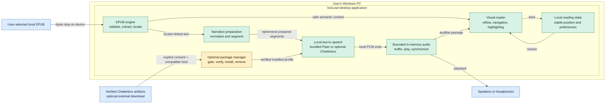

# Compact system diagram

This is the simplified view of VoxLeaf for product introductions and
high-level explanations. It shows the current user-facing reading and narration
path without milestone history, benchmark evidence, exact resource limits, or
development-only TTS branches. See the [canonical system diagram](system-diagram.md)
for those details and status authority.

## Key points

- EPUB content, prepared narration text, and TTS inference stay on the user's
  device.
- Generated audio is kept in bounded memory and is not persisted by default.
- The reader, audible highlight, and saved progress share stable EPUB
  locations rather than rendered page numbers.
- Piper is included with the Windows package. Chatterbox is a separate,
  explicitly requested download available only after the compatibility gate
  passes.
- Installation prerequisites, release signing, development-only Qwen profiles,
  exact limits, and validation history are intentionally left to the canonical
  diagram.
