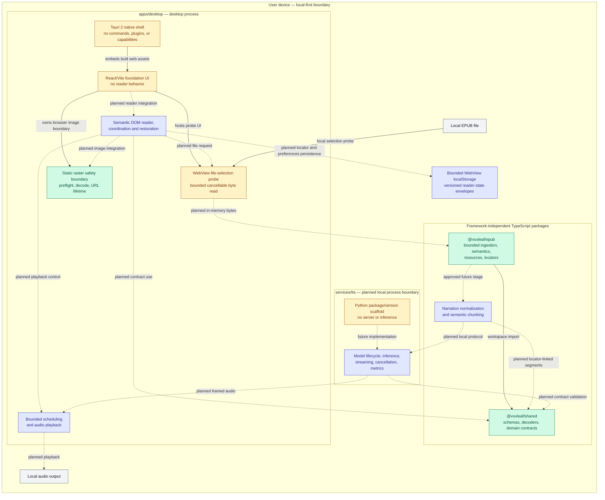

# System architecture diagram

## Purpose

This is the canonical high-level map of VoxLeaf's implemented and approved architecture. It shows major repository components, process and trust boundaries, dependencies between those components, and the intended EPUB-to-audio flow. It is an orientation aid; the architecture overview, accepted ADRs, roadmap, and active ExecPlans remain authoritative for detailed rules and decisions.

The diagrams intentionally omit classes, functions, exhaustive imports, exact schemas, security-budget values, UI layout, deployment packaging, and implementation choices that have not passed their roadmap decision gate. The visual-reader boundary is selected by ADR-0008, the raster safety boundary by ADR-0010, and the reader-state backend/ownership boundary by ADR-0011. The diagrams do not select a TTS engine, process transport, audio format, or playback API.

## Implementation-status legend

| Appearance | Meaning |
| --- | --- |
| Green, solid border | **Implemented:** exists in production source/configuration and has repository validation evidence. |
| Amber, solid border | **Partial/foundation:** a scaffold or supporting contract exists, but the component does not yet perform its intended product role. |
| Blue, solid border | **Approved planned:** required by an accepted ADR, the approved roadmap, or an active ExecPlan, but not implemented. |
| Gray | Local user/device context outside the repository. |
| Solid arrow | A currently configured dependency, embedding relationship, or implemented package-internal flow. |
| Dashed arrow | An approved but unimplemented integration or data flow. |

Status applies to the text inside each node. The partial file boundary, for example, proves local selection and bounded byte transfer but not publication opening or reading.

## Component-level architecture

The desktop now has a capability-free WebView file-selection probe and a bounded static-raster preflight/decode/source-lifetime boundary, but still has no dependency on `@voxleaf/epub` or `@voxleaf/shared`; its Tauri capability list remains empty. ADR-0011 approves bounded WebView `localStorage`, but no storage repository or save/restoration behavior exists yet. The file probe releases successful bytes instead of opening a publication, and no reader calls the raster boundary yet. The solid EPUB-to-shared dependency exists only between the framework-independent packages. No remote runtime service or external network dependency is approved for normal reading; the exact local desktop-to-TTS transport remains undecided.

## Primary EPUB-to-audio data flow

```mermaid
flowchart LR
  classDef implemented fill:#d1fae5,stroke:#047857,color:#064e3b
  classDef partial fill:#fef3c7,stroke:#b45309,color:#78350f
  classDef planned fill:#e0e7ff,stroke:#4338ca,color:#312e81
  classDef external fill:#f3f4f6,stroke:#4b5563,color:#111827

  file["Local EPUB file"]:::external
  selection["Desktop WebView selection<br/>and bounded byte-read probe"]:::partial
  opener["openEpubPublication<br/>(Uint8Array)"]:::implemented
  archive["ZIP/OCF inventory<br/>paths, limits, cancellation"]:::implemented
  packageData["Container, OPF, spine,<br/>navigation parsing"]:::implemented
  semantics["BookV1 and SHA-256 identity<br/>immutable safe semantics"]:::implemented
  publication["Opened publication<br/>lazy raster reads and locators"]:::implemented
  contracts["@voxleaf/shared<br/>book, locator, error validation"]:::implemented
  visualReader["Semantic scrolling reader<br/>and position restoration"]:::planned
  textPrep["Narration normalization<br/>and locator-linked chunks"]:::planned
  synthesis["Local TTS process<br/>engine and protocol undecided"]:::planned
  buffering["Bounded in-memory<br/>audio queue and startup gate"]:::planned
  playback["Desktop playback<br/>and synchronized highlighting"]:::planned

  file -->|implemented probe| selection
  selection -. planned integration .-> opener
  opener --> archive --> packageData --> semantics --> publication
  semantics -->|BookV1| contracts
  publication -->|locators and safe errors| contracts
  publication -. planned integration .-> visualReader
  visualReader -. planned .-> textPrep
  textPrep -. planned .-> synthesis
  synthesis -. planned frames .-> buffering
  buffering -. planned .-> playback
```

The capability-free selection/read probe and the solid package flow are separately implemented, but their dashed integration is not. The desktop releases probe bytes and cannot yet call `openEpubPublication`; everything after the opened-publication boundary also remains planned. VoxLeaf therefore cannot currently open, render, narrate, or play a user-selected book.

## Component notes and evidence

| Component | Responsibility and status evidence |
| --- | --- |
| Desktop shell | [`apps/desktop`](../../apps/desktop/) contains the React/Vite foundation UI, Task 1.2 local-file probe, Task 1.3 raster safety boundary, and minimal Tauri shell. [`local-epub-file.ts`](../../apps/desktop/src/file-ingress/local-epub-file.ts) enforces the early byte bound and abortable browser read. [`raster-image-policy.ts`](../../apps/desktop/src/reader/raster-image-policy.ts) preflights static metadata, while [`raster-image-source.ts`](../../apps/desktop/src/reader/raster-image-source.ts) bounds decode and URL ownership. [`main.rs`](../../apps/desktop/src-tauri/src/main.rs) still registers no commands, and [`tauri.conf.json`](../../apps/desktop/src-tauri/tauri.conf.json) grants no capabilities and allows only self/blob image sources. ADR-0009 and [ADR-0010](decisions/ADR-0010-bounded-raster-image-decode.md) accept these supporting boundaries; publication integration and reader behavior remain [Roadmap Milestone 4](../plans/roadmap.md#milestone-4-deliver-the-reflowable-visual-reader-and-position-restoration). |
| Shared contracts | [`packages/shared`](../../packages/shared/) owns canonical JSON Schemas, generated TypeScript wire types, runtime decoders, branded domain values, and a separate testing export. [ADR-0006](decisions/ADR-0006-json-schema-contract-authority.md) defines this authority; the completed [Milestone 2 plan](../plans/completed/M002-shared-contracts-and-test-harness.md) records validation. Contracts for persistence, sessions, narration, audio frames, and buffer state do not implement those systems. |
| EPUB package | [`packages/epub`](../../packages/epub/) exposes [`openEpubPublication`](../../packages/epub/src/public/open-epub-publication.ts), immutable semantic/publication types, bounded lazy raster reads, and deterministic locator creation and resolution. [ADR-0007](decisions/ADR-0007-secure-epub-ingestion-boundary.md) owns the security/support boundary; the completed [Milestone 3 plan](../plans/completed/M003-secure-epub-ingestion-and-document-model.md) records validation. It accepts bytes only and has no filesystem, network, DOM, renderer, persistence, TTS, or audio capability. |
| ZIP and XML primitives | `@voxleaf/epub` internally wraps exactly pinned `@zip.js/zip.js` and `saxes`. They are implementation details behind the archive/XML boundaries, not application services or public APIs. Selection and capability restrictions are recorded in [ADR-0007](decisions/ADR-0007-secure-epub-ingestion-boundary.md) and the [dependency inventory](../development/dependencies.md). |
| Reader, file/raster boundaries, coordinator, and persistence | ADR-0009/Task 1.2 implement the capability-free WebView selection/read boundary. ADR-0010/Task 1.3 implement static-raster metadata, decode, capacity, and object-URL lifecycle guards but no semantic image component. [ADR-0011](decisions/ADR-0011-bounded-web-storage-reader-state.md) approves two bounded versioned Web Storage envelopes, app-local display preferences, a 500 ms passive-save debounce, exact-identity restoration, content-free failures, and explicit desktop-owned migration. The [ADR-0008](decisions/ADR-0008-visual-reader-architecture.md) Task 1.6 amendment accepts 250-block incremental rendering, a 10,000-semantic-block/80,000-DOM-node ceiling, fixed recoverable fallback, and reference latency/memory gates measured by the test-only Playwright harness. [Roadmap Milestone 4](../plans/roadmap.md#milestone-4-deliver-the-reflowable-visual-reader-and-position-restoration) and the [active plan](../plans/active/M004-reflowable-visual-reader-and-position-restoration.md) retain implementation ownership. No desktop-to-EPUB integration, storage adapter, semantic target resolver, renderer, native file access, or application coordinator exists yet. File paths and native permissions remain outside the accepted boundary because `@voxleaf/epub` accepts bytes only. |
| Narration preparation | Approved but unimplemented normalization and semantic chunking from [Roadmap Milestone 5](../plans/roadmap.md#milestone-5-prepare-text-for-natural-narration) and the [active synchronized-reader plan](../plans/active/synchronized-reader-and-startup-buffer.md). It must preserve locator ranges and keep displayed source text separate from narration text. No package module currently performs this work. |
| TTS service | [`services/tts`](../../services/tts/) is a dependency-free Python package with version smoke behavior and cross-language test conformance only. [Roadmap Milestone 6](../plans/roadmap.md#milestone-6-prove-local-tts-feasibility-and-select-engine-profiles) owns engine evaluation, while [Milestone 7](../plans/roadmap.md#milestone-7-implement-the-local-tts-service-and-process-protocol) owns process lifecycle, protocol, streaming, and cancellation. No engine, server, model, transport, or hardware profile has been selected or implemented. |
| Audio scheduling and playback | [ADR-0002](decisions/ADR-0002-in-memory-audio.md) and [ADR-0004](decisions/ADR-0004-start-after-audio-lead.md) approve bounded memory and duration-gated startup. Shared audio/buffer contracts and fakes exist, but [Roadmap Milestone 8](../plans/roadmap.md#milestone-8-build-bounded-audio-playback-and-scheduling) owns the real queue, player, backpressure, underrun measurement, and startup gate. |
| Local device systems | Local EPUB selection is accepted through the capability-free WebView boundary and proven as a release probe, without retaining a path or file handle. ADR-0011 selects bounded WebView `localStorage` for reader state, but its repository is unimplemented; audio-output APIs remain undecided and unimplemented. Normal reading must not require a remote service or persist generated audio. |

## Remaining implementation and decision gates

The roadmap still requires the following implementation work or later decisions:

- Milestone 4 no longer has an unresolved reader-boundary gate: ADR-0008 plus its Task 1.6 amendment resolve visual rendering, navigation, active position, incremental large-chapter policy, and reference performance limits; ADR-0009 resolves local file ingress; ADR-0010 resolves static-raster decode/CSP/lifetime behavior; ADR-0011 resolves reader-state storage/save/migration ownership; and Playwright supplies the browser harness. Reader implementation, end-to-end measurements, and the native Windows WebView matrix remain later tasks rather than unresolved architecture.
- Milestone 6: measured balanced and CPU-compatible TTS engine profiles, model distribution, licensing, and supported hardware.
- Milestone 7: local process transport, framing, backpressure, exposure, and recovery.
- Milestone 8: internal audio format, playback mechanism, speed control, and benchmark-tuned buffer thresholds.
- Milestone 9: behavior when manual visual navigation conflicts with active narration following.

The diagram must not fill these gaps before the corresponding prototype, ADR, or roadmap/ExecPlan update approves a decision.

## Maintenance conditions

The author of a change must review this document when the change affects any of the following:

- a major system component or its implementation status;
- a package, module, process, trust, deployment, or runtime boundary;
- a dependency or allowed direction between major components;
- an important runtime or data flow, including cancellation and bounded-buffer flow;
- ownership or location of persisted data;
- interaction with local files, devices, processes, networks, or other external systems; or
- an ADR, roadmap milestone, or active ExecPlan that approves, removes, replaces, or defers architecture shown here.

Update the diagrams, legend, notes, and evidence links in the same change only when the documented high-level architecture or status actually changes. An internal refactor, file move within an unchanged boundary, test-only change, or implementation-detail replacement does not require a diagram edit when every documented component, boundary, dependency, and flow remains accurate.

Before completing a relevant task, verify every node and connection against current code/configuration, an accepted ADR, the approved roadmap, or an active ExecPlan; verify planned and implemented statuses remain visually distinct; check internal links; and run an existing Mermaid/documentation validator when the repository provides one. Do not add a production dependency solely to render this document.
