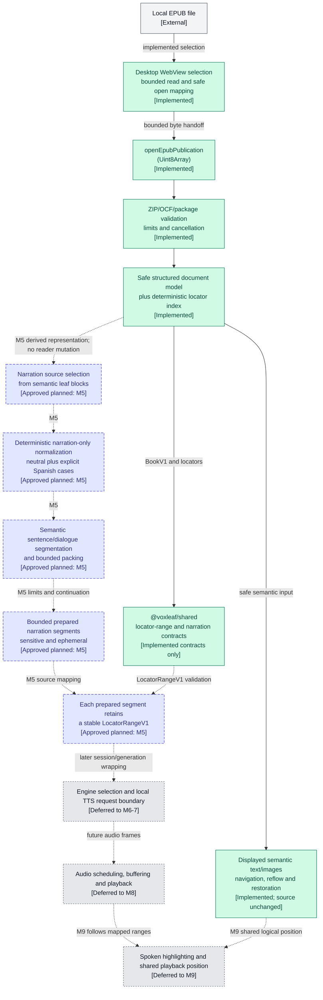

# System architecture diagram

## Purpose

This is the canonical high-level map of VoxLeaf's implemented and approved architecture. It shows major repository components, process and trust boundaries, dependencies between those components, and the intended EPUB-to-audio flow. It is an orientation aid; the architecture overview, accepted ADRs, roadmap, and active ExecPlans remain authoritative for detailed rules and decisions.

The diagrams intentionally omit classes, functions, exhaustive imports, exact schemas, security-budget values, UI layout, deployment packaging, and implementation choices that have not passed their roadmap decision gate. The visual-reader boundary is selected by ADR-0008, the raster safety boundary by ADR-0010, and the reader-state backend/ownership boundary by ADR-0011. The approved [Milestone 5 ExecPlan](../plans/active/M005-narration-text-preparation.md) authorizes planning and implementation of a separate narration-preparation transformation, but its production tasks have not started and its durable API/profile decisions remain gated by Task 1.1. The diagrams do not select a TTS engine, process transport, audio format, or playback API.

## Implementation-status legend

| Appearance | Meaning |
| --- | --- |
| Green, solid border and `[Implemented]` label | **Implemented:** exists in production source/configuration and has repository validation evidence. |
| Amber, heavy border and `[In progress]` label | **In progress:** production implementation has begun but applicable milestone validation is incomplete. No component currently has this status. |
| Blue, dashed border and `[Approved planned]` label | **Approved planned:** authorized by an accepted ADR, the roadmap, or an approved active ExecPlan, but production implementation has not started. |
| Gray, dashed border and `[Deferred]` label | **Deferred:** belongs to a later milestone and may still have unresolved technology or behavior decisions. |
| Amber, dotted border and `[Foundation only]` label | **Foundation only:** a scaffold or supporting contract exists, but the component does not perform its intended product role. |
| Gray, solid border and `[External]` label | Local user/device context outside the repository. |
| Solid arrow | A currently configured dependency, embedding relationship, or implemented package-internal flow. |
| Dashed arrow | An approved planned or deferred integration/data flow; its label identifies the owning milestone or boundary. |

Status applies to the text inside each node, not color alone. The file-open boundary proves local selection, bounded byte transfer, package opening, safe metadata presentation, semantic text/image rendering, explicit navigation, semantic code-point/DOM range mapping, passive normalized visual-position tracking, viewport/preference reflow preservation, and exact or nearest-valid saved-position restoration.

## Component-level architecture

```mermaid
flowchart TB
  classDef implemented fill:#d1fae5,stroke:#047857,color:#064e3b
  classDef inprogress fill:#fef3c7,stroke:#b45309,stroke-width:3px,color:#78350f
  classDef planned fill:#e0e7ff,stroke:#4338ca,stroke-dasharray:6 3,color:#312e81
  classDef deferred fill:#e5e7eb,stroke:#4b5563,stroke-dasharray:3 3,color:#111827
  classDef foundation fill:#fef3c7,stroke:#b45309,stroke-dasharray:2 2,color:#78350f
  classDef external fill:#f3f4f6,stroke:#4b5563,color:#111827

  subgraph device["User device — local-first boundary"]
    epubFile["Local EPUB file<br/>[External]"]:::external
    audioDevice["Local audio output<br/>[External]"]:::external
    readingStore["Bounded WebView localStorage<br/>two fixed reader-state keys<br/>[Implemented]"]:::implemented

    subgraph desktop["apps/desktop — desktop process"]
      nativeShell["Tauri 2 native shell<br/>no commands, plugins, or capabilities<br/>[Foundation only]"]:::foundation
      webShell["React/Vite reader application<br/>lifecycle state and metadata<br/>[Implemented]"]:::implemented
      fileBoundary["WebView file-open boundary<br/>bounded read and safe mapping<br/>[Implemented]"]:::implemented
      rasterBoundary["Static raster safety boundary<br/>preflight, decode, URL lifetime<br/>[Implemented]"]:::implemented
      publicationSession["Publication session owner<br/>cancel, replace, close<br/>[Implemented]"]:::implemented
      reader["Semantic text/image DOM reader<br/>navigation, preferences, logical position,<br/>reflow and restoration<br/>[Implemented]"]:::implemented
      saveCoordinator["Reader-state save coordinator<br/>debounce, coalescing, lifecycle flush<br/>[Implemented]"]:::implemented
      stateRepository["Versioned reader-state repository<br/>strict decode, bounds, migration dispatch<br/>[Implemented]"]:::implemented
      player["Bounded scheduling and audio playback<br/>[Deferred to Milestone 8]"]:::deferred
      nativeShell -->|embeds built web assets| webShell
      webShell -->|open action and safe state| fileBoundary
      webShell -->|owns browser image boundary| rasterBoundary
      webShell -->|ready-state semantic render| reader
      fileBoundary -->|bounded bytes and lifecycle| publicationSession
      publicationSession -->|ready publication| reader
      reader -->|bounded local image decode| rasterBoundary
      reader -->|canonical locator and preferences| saveCoordinator
      webShell -->|replace, close, hidden, pagehide| saveCoordinator
      saveCoordinator -->|validated latest-only writes| stateRepository
      stateRepository -->|two fixed bounded keys| readingStore
      reader -.->|Milestone 9 synchronization| player
    end

    subgraph libraries["Framework-independent TypeScript packages"]
      shared["@voxleaf/shared<br/>schemas, validators, decoders,<br/>locator-range and narration contracts<br/>[Implemented contracts only]"]:::implemented
      subgraph epubPackage["@voxleaf/epub"]
        epubCore["Bounded ingestion, immutable semantics,<br/>resources and locators<br/>[Implemented]"]:::implemented
        narration["Narration source projection, deterministic normalization,<br/>semantic segmentation and bounded prepared segments<br/>[Approved planned: Milestone 5]"]:::planned
        epubCore -.->|immutable semantic model and locator index| narration
      end
      epubCore -->|workspace import| shared
      narration -.->|LocatorRangeV1 and sensitive-text contract boundary| shared
    end

    subgraph tts["services/tts — planned local process boundary"]
      ttsFoundation["Python package/version scaffold<br/>no server or inference<br/>[Foundation only]"]:::foundation
      ttsRuntime["Engine selection, process protocol,<br/>inference, streaming and cancellation<br/>[Deferred to Milestones 6-7]"]:::deferred
      ttsFoundation -.->|later implementation| ttsRuntime
    end
  end

  epubFile -->|local selection| fileBoundary
  publicationSession -->|calls opener and owns returned handle| epubCore
  publicationSession -->|safe error contract| shared
  reader -->|locator and index contracts| shared
  saveCoordinator -->|persisted state decoder| shared
  stateRepository -->|nested state decoder| shared
  stateRepository -->|decoded preferences and exact-book locator| reader
  narration -.->|later session-bound TTS request| ttsRuntime
  ttsRuntime -.->|future contract validation| shared
  ttsRuntime -.->|future framed audio| player
  player -.->|future playback| audioDevice
```

The capability-free file-open flow now passes one bounded in-memory read to the UI-independent publication-session owner and presents only validated title/authors or fixed safe outcomes. The session provides cancellation, replacement, stale-result rejection, and publication cleanup; the desktop shell adds an immutable idle/opening/ready/empty/failure/closing surface, explicit close/reopen, fixed presentation-error containment, and one continuous responsive reader with closed display preferences. The reader consumes the bounded static-raster boundary through lazy serialized resource reads, accessible per-image fallback, and lifecycle-owned Blob URL release; the Tauri capability list remains empty. The implemented ADR-0011 repository isolates two fixed bounded `localStorage` keys behind asynchronous validated operations. The application restores decoded global preferences and an exact-identity locator before the ready reader settles, uses package-owned exact/nearest resolution and content-free fallbacks, and saves canonical locators through the approved 500 ms/immediate/lifecycle policy without delaying reader actions or publication cleanup. Milestone 5 will add a separate framework-independent transformation over the immutable semantic model; it will not pass normalized narration text back into the reader. No remote runtime service or external network dependency is approved for normal reading, and the exact local desktop-to-TTS transport remains undecided.

## Primary EPUB-to-audio data flow

The desktop can select a local file, transfer its bounded bytes to `openEpubPublication`, own the opened handle, present validated title/authors or a fixed recoverable outcome, render one spine document's supported text and bounded static raster images through application-owned semantic elements, enforce the accepted incremental large-chapter ceiling/fallback, navigate through hierarchical TOC entries, internal targets, and previous/next chapter controls using canonical package-resolved locators, round-trip legal semantic code-point offsets through registered DOM ranges, track the passage at a fixed application reading line as a package-normalized logical locator, return that locator to the reading line after viewport or approved preference reflow, and persist bounded decoder-validated local reader-state envelopes through one replaceable repository.

Milestone 5 is approved but not implemented. Its flow starts from the immutable safe structured document model, derives narration source text, normalizes it without changing displayed text, segments it deterministically, and returns bounded sensitive prepared segments that retain stable source locator ranges. Exact public operation names, profile limits, and lifecycle outcomes remain Task 1.1 decisions. TTS requests, inference, audio frames, scheduling, playback, highlighting, and visual/audio synchronization remain deferred to Milestones 6 through 9.

## Component notes and evidence

| Component | Responsibility and status evidence |
| --- | --- |
| Desktop shell | [`apps/desktop`](../../apps/desktop/) contains the React/Vite open UI, Task 1.2 local-file boundary, Task 1.3 raster safety boundary, Task 2.2 [`publication-session.ts`](../../apps/desktop/src/publication/publication-session.ts), Task 2.3 [`local-publication-open.ts`](../../apps/desktop/src/publication/local-publication-open.ts), Task 2.4 [`reader-lifecycle.ts`](../../apps/desktop/src/reader/reader-lifecycle.ts) and [`ReaderErrorBoundary.tsx`](../../apps/desktop/src/reader/ReaderErrorBoundary.tsx), Task 3.1 [`SemanticDocument.tsx`](../../apps/desktop/src/reader/SemanticDocument.tsx), Task 3.2 [`reader-navigation.ts`](../../apps/desktop/src/reader/reader-navigation.ts) and [`ReaderPublication.tsx`](../../apps/desktop/src/reader/ReaderPublication.tsx), Task 3.3 [`SemanticRasterImage.tsx`](../../apps/desktop/src/reader/SemanticRasterImage.tsx) and [`publication-raster-image-loader.ts`](../../apps/desktop/src/reader/publication-raster-image-loader.ts), Task 3.4 [`reader-preferences.ts`](../../apps/desktop/src/reader/reader-preferences.ts) and [`ReaderPreferences.tsx`](../../apps/desktop/src/reader/ReaderPreferences.tsx), Task 3.6 [`large-chapter-rendering.ts`](../../apps/desktop/src/reader/large-chapter-rendering.ts), Task 4.4 [`reader-position-repository.ts`](../../apps/desktop/src/persistence/reader-position-repository.ts), Task 4.5 [`reader-position-save-coordinator.ts`](../../apps/desktop/src/persistence/reader-position-save-coordinator.ts), Task 4.6 [`reader-position-restore-coordinator.ts`](../../apps/desktop/src/persistence/reader-position-restore-coordinator.ts), and the minimal Tauri shell. The open coordinator composes the abortable 100-MiB [`local-epub-file.ts`](../../apps/desktop/src/file-ingress/local-epub-file.ts) read with the session, closes prior state at replacement intent, rejects stale completion, and exposes only validated metadata or closed safe outcomes. The lifecycle controller alone publishes ready publication data; its other five states clear the prior reference, while the error boundary triggers fixed failure plus cleanup without logging the thrown value. The semantic renderer displays one active spine document through exhaustive application-owned React elements, inherited language/direction, package-resolved internal controls, lazy bounded static raster images, recursive block/projected-node preflight, and cancellable 250-block yielded batches without source identities or publisher URLs. Over-limit documents show fixed application content before any partial chapter or image work. The publication-scoped image loader serializes at most eight outstanding reads, clears caller-owned bytes, delegates preflight/decode to [`raster-image-source.ts`](../../apps/desktop/src/reader/raster-image-source.ts), and closes with the reader; per-image components abort stale work and release every ready URL on replacement/unmount. Failures remain accessible local placeholders. The reader coordinator owns canonical active locator/document state, hierarchical TOC/internal-link/chapter-step intents, unavailable explanations, explicit-navigation focus, the current closed display preferences, pre-change locator-bearing preference-reflow intents, and last-valid-locator preservation when a destination exceeds the renderer ceiling. Application-owned CSS maps preferences to one responsive continuous layout. The save coordinator accepts only exact package-normalized locators, coalesces bounded latest-only position/preference work, serializes each write stream, flushes on approved application/browser lifecycle signals, and detaches timers/listeners on close. The app-scoped restore coordinator reads preferences once, performs exact-identity position lookup, rejects stale publication reads, and delegates exact/nearest locator resolution to the opened publication; the reader then materializes and aligns the destination before reporting settlement. The reader-state repository revalidates writes and strictly decodes two fixed bounded versioned Web Storage envelopes, performs exact-identity lookup and deterministic most-recent eviction, preserves unsupported/oversized data, and returns only fixed nonfatal outcomes; no leaf component accesses storage. [`raster-image-policy.ts`](../../apps/desktop/src/reader/raster-image-policy.ts) retains the immutable static metadata limits. [`main.rs`](../../apps/desktop/src-tauri/src/main.rs) still registers no commands, and [`tauri.conf.json`](../../apps/desktop/src-tauri/tauri.conf.json) grants no capabilities and permits only self scripts/styles plus self/blob images, with no `unsafe-eval` or network origin. The Vite production-build guard rejects Ajv modules and runtime code generation; the Windows native startup smoke verifies mount, packaged same-file reselection, picker cancellation, ready replacement, deterministic stale-read abort, real exact/max-plus-one disposable-file boundaries, repository-authored synthetic image decode/open, locator save, full application restart, exact-file reselection/restoration, close, zero page/console errors, and zero external requests. ADR-0008, ADR-0009, [ADR-0010](decisions/ADR-0010-bounded-raster-image-decode.md), and [ADR-0011](decisions/ADR-0011-bounded-web-storage-reader-state.md) define these boundaries. [Roadmap Milestone 4](../plans/roadmap.md#milestone-4-deliver-the-reflowable-visual-reader-and-position-restoration) is complete; narration and audio remain later milestones. |
| Shared contracts | [`packages/shared`](../../packages/shared/) owns canonical JSON Schemas, generated TypeScript wire types and self-contained standalone validators, runtime decoders, branded domain values, and a separate testing export. Ajv is generation/test-only; production decoders import generated type guards and never compile schemas. [ADR-0006](decisions/ADR-0006-json-schema-contract-authority.md) defines this authority; the completed [Milestone 2 plan](../plans/completed/M002-shared-contracts-and-test-harness.md) and [Milestone 4 plan](../plans/completed/M004-reflowable-visual-reader-and-position-restoration.md) record validation. Contracts for persistence, sessions, narration, audio frames, and buffer state do not implement those systems. |
| EPUB package | [`packages/epub`](../../packages/epub/) exposes [`openEpubPublication`](../../packages/epub/src/public/open-epub-publication.ts), immutable semantic/publication types, bounded lazy raster reads, deterministic locators, structural locator resolution, and package-owned semantic-target resolution. [ADR-0007](decisions/ADR-0007-secure-epub-ingestion-boundary.md) owns the security/support boundary; the completed [Milestone 3 plan](../plans/completed/M003-secure-epub-ingestion-and-document-model.md) and [Milestone 4 plan](../plans/completed/M004-reflowable-visual-reader-and-position-restoration.md) record validation and implementation ownership. It accepts bytes only and has no filesystem, network, DOM, renderer, persistence, TTS, or audio capability. |
| ZIP and XML primitives | `@voxleaf/epub` internally wraps exactly pinned `@zip.js/zip.js` and `saxes`. They are implementation details behind the archive/XML boundaries, not application services or public APIs. Selection and capability restrictions are recorded in [ADR-0007](decisions/ADR-0007-secure-epub-ingestion-boundary.md) and the [dependency inventory](../development/dependencies.md). |
| Reader, file/raster boundaries, coordinator, and persistence | Tasks 1.2-3.6 implement the capability-free local EPUB boundary, publication lifecycle, semantic text/image reader, navigation, closed preferences, and bounded large-chapter policy. Task 4.1 owns content-free bidirectional semantic-code-point/DOM-range mapping. Task 4.2 tracks and package-normalizes the passage at the fixed application reading line with bounded nearby geometry work. Task 4.3 adds a publication-scoped reflow transaction that captures and normalizes the active locator, suppresses passive samples, coalesces rapid preference/viewport changes, aligns the exact range or block-start fallback after stable animation frames, bounds missing-target work, and cancels on navigation/root replacement/close. Task 4.4 implements ADR-0011's replaceable asynchronous repository, two fixed bounded versioned Web Storage envelopes, strict shared/app-local decoding, exact-identity lookup, most-recent eviction, fixed failure outcomes, and independent migration dispatch. Task 4.5 adds the application-owned 500 ms passive/immediate settled/lifecycle save coordinator, exact canonical-locator admission, latest-only bounded supersession, stale-publication rejection, independent preference writes, and nonblocking failure containment. Task 4.6 adds one app-scoped restore coordinator that reads preferences once, performs exact-identity lookup, delegates exact/nearest resolution to the active publication, gates ready reader settlement on target materialization and range alignment, contains stale/failing reads, and delays recovered-locator persistence until settlement. Reader position components emit no locator or publisher identity into the DOM and startup restoration performs no focus or URL/history mutation. File paths and native permissions remain outside the boundary because `@voxleaf/epub` accepts bytes only. |
| Narration preparation | Approved but not started under [Roadmap Milestone 5](../plans/roadmap.md#milestone-5-prepare-text-for-natural-narration) and the [active Milestone 5 ExecPlan](../plans/active/M005-narration-text-preparation.md). The planned framework-independent transformation derives narration source text from immutable safe semantic leaf blocks, applies deterministic narration-only normalization and semantic segmentation, bounds each returned batch/segment, and keeps every prepared segment related to a stable `LocatorRangeV1`. It must not mutate displayed text, persist narration, or introduce model-specific preprocessing. No `packages/epub` narration module, public preparation operation, normalization corpus, segmentation test, or accepted narration ADR exists yet; Task 1.1 owns those durable decisions. |
| TTS service | [`services/tts`](../../services/tts/) is a dependency-free Python package with version smoke behavior and cross-language test conformance only. [Roadmap Milestone 6](../plans/roadmap.md#milestone-6-prove-local-tts-feasibility-and-select-engine-profiles) owns engine evaluation, while [Milestone 7](../plans/roadmap.md#milestone-7-implement-the-local-tts-service-and-process-protocol) owns process lifecycle, protocol, streaming, and cancellation. No engine, server, model, transport, or hardware profile has been selected or implemented. |
| Audio scheduling and playback | [ADR-0002](decisions/ADR-0002-in-memory-audio.md) and [ADR-0004](decisions/ADR-0004-start-after-audio-lead.md) approve bounded memory and duration-gated startup. Shared audio/buffer contracts and fakes exist, but [Roadmap Milestone 8](../plans/roadmap.md#milestone-8-build-bounded-audio-playback-and-scheduling) owns the real queue, player, backpressure, underrun measurement, and startup gate. |
| Local device systems | Local EPUB selection is accepted through the capability-free WebView boundary and proven as a release probe, without retaining a path or file handle. ADR-0011's bounded WebView `localStorage` repository, application save lifecycle, and exact-book restore flow are implemented with no native command, plugin, capability, or path contract. Audio-output APIs remain undecided and unimplemented. Normal reading must not require a remote service or persist generated audio. |

## Remaining implementation and decision gates

The roadmap still requires the following implementation work or later decisions:

- Milestone 4 is complete: ADR-0008 plus its Task 1.6 amendment resolve visual rendering, navigation, active position, incremental large-chapter policy, and reference performance limits; ADR-0009 resolves local file ingress; ADR-0010 resolves static-raster decode/CSP/lifetime behavior; ADR-0011 resolves reader-state storage/save/migration ownership; and the desktop implements those boundaries with deterministic, Chromium, packaged-WebView2, and pull-request CI evidence.
- Milestone 5: accept the narration-preparation ADR and deterministic profile/corpus/bounds, then implement source projection, narration-only normalization, semantic segmentation, bounded continuation/cancellation, and stable locator-range mapping inside the approved EPUB-package boundary. Until those gates pass, the status remains approved planned.
- Milestone 6: measured balanced and CPU-compatible TTS engine profiles, model distribution, licensing, and supported hardware.
- Milestone 7: local process transport, framing, backpressure, exposure, and recovery.
- Milestone 8: internal audio format, playback mechanism, speed control, and benchmark-tuned buffer thresholds.
- Milestone 9: behavior when manual visual navigation conflicts with active narration following.

The diagram must not fill these gaps before the corresponding prototype, ADR, or roadmap/ExecPlan update approves a decision.

## Maintenance conditions

The author of a change must review this document when the change affects any of the following:

- a major system component or its implementation status;
- a package, module, process, trust, deployment, or runtime boundary;
- a dependency or allowed direction between major components;
- an important runtime or data flow, including cancellation and bounded-buffer flow;
- ownership or location of persisted data;
- interaction with local files, devices, processes, networks, or other external systems; or
- an ADR, roadmap milestone, or active ExecPlan that approves, removes, replaces, or defers architecture shown here.

Update the diagrams, legend, notes, and evidence links in the same change only when the documented high-level architecture or status actually changes. An internal refactor, file move within an unchanged boundary, test-only change, or implementation-detail replacement does not require a diagram edit when every documented component, boundary, dependency, and flow remains accurate.

Before completing a relevant task, verify every node and connection against current code/configuration, an accepted ADR, the approved roadmap, or an active ExecPlan; verify planned and implemented statuses remain visually distinct; check internal links; and run an existing Mermaid/documentation validator when the repository provides one. Do not add a production dependency solely to render this document.
