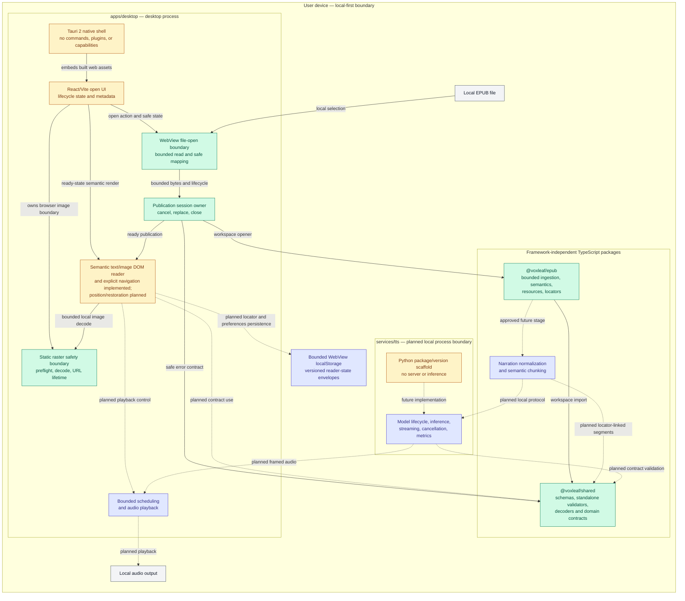

# System architecture diagram

## Purpose

This is the canonical high-level map of VoxLeaf's implemented and approved architecture. It shows major repository components, process and trust boundaries, dependencies between those components, and the intended EPUB-to-audio flow. It is an orientation aid; the architecture overview, accepted ADRs, roadmap, and active ExecPlans remain authoritative for detailed rules and decisions.

The diagrams intentionally omit classes, functions, exhaustive imports, exact schemas, security-budget values, UI layout, deployment packaging, and implementation choices that have not passed their roadmap decision gate. The visual-reader boundary is selected by ADR-0008, the raster safety boundary by ADR-0010, and the reader-state backend/ownership boundary by ADR-0011. The diagrams do not select a TTS engine, process transport, audio format, or playback API.

## Implementation-status legend

| Appearance | Meaning |
| --- | --- |
| Green, solid border | **Implemented:** exists in production source/configuration and has repository validation evidence. |
| Amber, solid border | **Partial/foundation:** a scaffold or supporting contract exists, but the component does not yet perform its intended product role. |
| Blue, solid border | **Approved planned:** required by an accepted ADR, the approved roadmap, or an active ExecPlan, but not implemented. |
| Gray | Local user/device context outside the repository. |
| Solid arrow | A currently configured dependency, embedding relationship, or implemented package-internal flow. |
| Dashed arrow | An approved but unimplemented integration or data flow. |

Status applies to the text inside each node. The file-open boundary proves local selection, bounded byte transfer, package opening, safe metadata presentation, semantic text/image rendering, and explicit navigation, but it does not yet prove passive position tracking or restoration.

## Component-level architecture

The capability-free file-open flow now passes one bounded in-memory read to the UI-independent publication-session owner and presents only validated title/authors or fixed safe outcomes. The session provides cancellation, replacement, stale-result rejection, and publication cleanup; the desktop shell adds an immutable idle/opening/ready/empty/failure/closing surface, explicit close/reopen, and fixed presentation-error containment. The reader consumes the bounded static-raster boundary through lazy serialized resource reads, accessible per-image fallback, and lifecycle-owned Blob URL release; the Tauri capability list remains empty. ADR-0011 approves bounded WebView `localStorage`, but no storage repository or save/restoration behavior exists yet. No remote runtime service or external network dependency is approved for normal reading; the exact local desktop-to-TTS transport remains undecided.

## Primary EPUB-to-audio data flow

```mermaid
flowchart LR
  classDef implemented fill:#d1fae5,stroke:#047857,color:#064e3b
  classDef partial fill:#fef3c7,stroke:#b45309,color:#78350f
  classDef planned fill:#e0e7ff,stroke:#4338ca,color:#312e81
  classDef external fill:#f3f4f6,stroke:#4b5563,color:#111827

  file["Local EPUB file"]:::external
  selection["Desktop WebView selection<br/>bounded read and safe open mapping"]:::implemented
  session["Desktop publication session<br/>cancel, replace, close"]:::implemented
  opener["openEpubPublication<br/>(Uint8Array)"]:::implemented
  archive["ZIP/OCF inventory<br/>paths, limits, cancellation"]:::implemented
  packageData["Container, OPF, spine,<br/>navigation parsing"]:::implemented
  semantics["BookV1 and SHA-256 identity<br/>immutable safe semantics"]:::implemented
  publication["Opened publication<br/>lazy raster reads and locators"]:::implemented
  contracts["@voxleaf/shared<br/>generated contract validation"]:::implemented
  visualReader["Semantic text/images and explicit navigation implemented;<br/>position tracking and restoration planned"]:::partial
  textPrep["Narration normalization<br/>and locator-linked chunks"]:::planned
  synthesis["Local TTS process<br/>engine and protocol undecided"]:::planned
  buffering["Bounded in-memory<br/>audio queue and startup gate"]:::planned
  playback["Desktop playback<br/>and synchronized highlighting"]:::planned

  file -->|implemented selection| selection
  selection -->|bounded byte handoff| session
  session -->|implemented package call| opener
  opener --> archive --> packageData --> semantics --> publication
  publication -->|owned handle| session
  semantics -->|BookV1| contracts
  publication -->|locators and safe errors| contracts
  session -->|starting spine semantics| visualReader
  visualReader -. planned .-> textPrep
  textPrep -. planned .-> synthesis
  synthesis -. planned frames .-> buffering
  buffering -. planned .-> playback
```

The desktop can select a local file, transfer its bounded bytes to `openEpubPublication`, own the opened handle, present validated title/authors or a fixed recoverable outcome, render one spine document's supported text and bounded static raster images through application-owned semantic elements, and navigate through hierarchical TOC entries, internal targets, and previous/next chapter controls using canonical package-resolved locators. Passive position tracking, large-chapter enforcement, restoration, narration, and playback remain planned.

## Component notes and evidence

| Component | Responsibility and status evidence |
| --- | --- |
| Desktop shell | [`apps/desktop`](../../apps/desktop/) contains the React/Vite open UI, Task 1.2 local-file boundary, Task 1.3 raster safety boundary, Task 2.2 [`publication-session.ts`](../../apps/desktop/src/publication/publication-session.ts), Task 2.3 [`local-publication-open.ts`](../../apps/desktop/src/publication/local-publication-open.ts), Task 2.4 [`reader-lifecycle.ts`](../../apps/desktop/src/reader/reader-lifecycle.ts) and [`ReaderErrorBoundary.tsx`](../../apps/desktop/src/reader/ReaderErrorBoundary.tsx), Task 3.1 [`SemanticDocument.tsx`](../../apps/desktop/src/reader/SemanticDocument.tsx), Task 3.2 [`reader-navigation.ts`](../../apps/desktop/src/reader/reader-navigation.ts) and [`ReaderPublication.tsx`](../../apps/desktop/src/reader/ReaderPublication.tsx), Task 3.3 [`SemanticRasterImage.tsx`](../../apps/desktop/src/reader/SemanticRasterImage.tsx) and [`publication-raster-image-loader.ts`](../../apps/desktop/src/reader/publication-raster-image-loader.ts), and the minimal Tauri shell. The open coordinator composes the abortable 100-MiB [`local-epub-file.ts`](../../apps/desktop/src/file-ingress/local-epub-file.ts) read with the session, closes prior state at replacement intent, rejects stale completion, and exposes only validated metadata or closed safe outcomes. The lifecycle controller alone publishes ready publication data; its other five states clear the prior reference, while the error boundary triggers fixed failure plus cleanup without logging the thrown value. The semantic renderer displays one active spine document through exhaustive application-owned React elements, inherited language/direction, package-resolved internal controls, and lazy bounded static raster images without source identities or publisher URLs. The publication-scoped image loader serializes at most eight outstanding reads, clears caller-owned bytes, delegates preflight/decode to [`raster-image-source.ts`](../../apps/desktop/src/reader/raster-image-source.ts), and closes with the reader; per-image components abort stale work and release every ready URL on replacement/unmount. Failures remain accessible local placeholders. The navigation coordinator owns canonical active locator/document state, hierarchical TOC/internal-link/chapter-step intents, unavailable explanations, and explicit-navigation focus. [`raster-image-policy.ts`](../../apps/desktop/src/reader/raster-image-policy.ts) retains the immutable static metadata limits. [`main.rs`](../../apps/desktop/src-tauri/src/main.rs) still registers no commands, and [`tauri.conf.json`](../../apps/desktop/src-tauri/tauri.conf.json) grants no capabilities and permits only self scripts/styles plus self/blob images, with no `unsafe-eval` or network origin. The Vite production-build guard rejects Ajv modules and runtime code generation; the Windows native startup smoke verifies mount, repository-authored synthetic image decode/open/close, zero page/console errors, and zero external requests. ADR-0008, ADR-0009, and [ADR-0010](decisions/ADR-0010-bounded-raster-image-decode.md) define these boundaries; remaining reader behavior stays in [Roadmap Milestone 4](../plans/roadmap.md#milestone-4-deliver-the-reflowable-visual-reader-and-position-restoration). |
| Shared contracts | [`packages/shared`](../../packages/shared/) owns canonical JSON Schemas, generated TypeScript wire types and self-contained standalone validators, runtime decoders, branded domain values, and a separate testing export. Ajv is generation/test-only; production decoders import generated type guards and never compile schemas. [ADR-0006](decisions/ADR-0006-json-schema-contract-authority.md) defines this authority; the completed [Milestone 2 plan](../plans/completed/M002-shared-contracts-and-test-harness.md) and active [Milestone 4 plan](../plans/active/M004-reflowable-visual-reader-and-position-restoration.md) record validation. Contracts for persistence, sessions, narration, audio frames, and buffer state do not implement those systems. |
| EPUB package | [`packages/epub`](../../packages/epub/) exposes [`openEpubPublication`](../../packages/epub/src/public/open-epub-publication.ts), immutable semantic/publication types, bounded lazy raster reads, deterministic locators, structural locator resolution, and package-owned semantic-target resolution. [ADR-0007](decisions/ADR-0007-secure-epub-ingestion-boundary.md) owns the security/support boundary; the completed [Milestone 3 plan](../plans/completed/M003-secure-epub-ingestion-and-document-model.md) and active [Milestone 4 plan](../plans/active/M004-reflowable-visual-reader-and-position-restoration.md) record validation and implementation ownership. It accepts bytes only and has no filesystem, network, DOM, renderer, persistence, TTS, or audio capability. |
| ZIP and XML primitives | `@voxleaf/epub` internally wraps exactly pinned `@zip.js/zip.js` and `saxes`. They are implementation details behind the archive/XML boundaries, not application services or public APIs. Selection and capability restrictions are recorded in [ADR-0007](decisions/ADR-0007-secure-epub-ingestion-boundary.md) and the [dependency inventory](../development/dependencies.md). |
| Reader, file/raster boundaries, coordinator, and persistence | ADR-0009/Tasks 1.2 and 2.3 implement the capability-free WebView selection/read/open boundary and safe metadata presentation; Task 2.2 implements its desktop-to-EPUB publication-session owner; Task 2.4 implements the surrounding accessible lifecycle state, empty recovery, close/reopen, stale-view clearing, and presentation-error cleanup. Task 3.1 implements the exhaustive semantic text renderer and deterministic starting-spine selection through the first canonical located block. Task 3.2 implements the first reader coordinator: it owns canonical active document/locator state, caches package target outcomes, preserves hierarchical TOC order, activates available internal targets, steps through readable spine chapters via locator resolution, disables chapter boundaries, explains unavailable destinations, and moves focus only after explicit navigation. All controls converge on one coordinator commit path. The DOM still emits no publisher markup, arbitrary attributes/styles, source IDs/fragments, resource identities, URLs, or history entries. Raster values remain fixed placeholders. ADR-0010/Task 1.3 implement static-raster metadata, decode, capacity, and object-URL lifecycle guards but no semantic image component. [ADR-0011](decisions/ADR-0011-bounded-web-storage-reader-state.md) approves two bounded versioned Web Storage envelopes, app-local display preferences, a 500 ms passive-save debounce, exact-identity restoration, content-free failures, and explicit desktop-owned migration. The ADR-0008 Task 1.6 amendment accepts 250-block incremental rendering, a 10,000-semantic-block/80,000-DOM-node ceiling, fixed recoverable fallback, and reference latency/memory gates measured by the test-only Playwright harness. [Roadmap Milestone 4](../plans/roadmap.md#milestone-4-deliver-the-reflowable-visual-reader-and-position-restoration) and the [active plan](../plans/active/M004-reflowable-visual-reader-and-position-restoration.md) retain implementation ownership. No storage adapter, semantic image integration, native file access, passive locator/DOM mapper, reflow/restoration coordinator, or production large-chapter scheduler exists yet. File paths and native permissions remain outside the accepted boundary because `@voxleaf/epub` accepts bytes only. |
| Narration preparation | Approved but unimplemented normalization and semantic chunking from [Roadmap Milestone 5](../plans/roadmap.md#milestone-5-prepare-text-for-natural-narration) and the [active synchronized-reader plan](../plans/active/synchronized-reader-and-startup-buffer.md). It must preserve locator ranges and keep displayed source text separate from narration text. No package module currently performs this work. |
| TTS service | [`services/tts`](../../services/tts/) is a dependency-free Python package with version smoke behavior and cross-language test conformance only. [Roadmap Milestone 6](../plans/roadmap.md#milestone-6-prove-local-tts-feasibility-and-select-engine-profiles) owns engine evaluation, while [Milestone 7](../plans/roadmap.md#milestone-7-implement-the-local-tts-service-and-process-protocol) owns process lifecycle, protocol, streaming, and cancellation. No engine, server, model, transport, or hardware profile has been selected or implemented. |
| Audio scheduling and playback | [ADR-0002](decisions/ADR-0002-in-memory-audio.md) and [ADR-0004](decisions/ADR-0004-start-after-audio-lead.md) approve bounded memory and duration-gated startup. Shared audio/buffer contracts and fakes exist, but [Roadmap Milestone 8](../plans/roadmap.md#milestone-8-build-bounded-audio-playback-and-scheduling) owns the real queue, player, backpressure, underrun measurement, and startup gate. |
| Local device systems | Local EPUB selection is accepted through the capability-free WebView boundary and proven as a release probe, without retaining a path or file handle. ADR-0011 selects bounded WebView `localStorage` for reader state, but its repository is unimplemented; audio-output APIs remain undecided and unimplemented. Normal reading must not require a remote service or persist generated audio. |

## Remaining implementation and decision gates

The roadmap still requires the following implementation work or later decisions:

- Milestone 4 no longer has an unresolved reader-boundary gate: ADR-0008 plus its Task 1.6 amendment resolve visual rendering, navigation, active position, incremental large-chapter policy, and reference performance limits; ADR-0009 resolves local file ingress; ADR-0010 resolves static-raster decode/CSP/lifetime behavior; ADR-0011 resolves reader-state storage/save/migration ownership; and Playwright supplies the browser harness. Reader implementation, end-to-end measurements, and the native Windows WebView matrix remain later tasks rather than unresolved architecture.
- Milestone 6: measured balanced and CPU-compatible TTS engine profiles, model distribution, licensing, and supported hardware.
- Milestone 7: local process transport, framing, backpressure, exposure, and recovery.
- Milestone 8: internal audio format, playback mechanism, speed control, and benchmark-tuned buffer thresholds.
- Milestone 9: behavior when manual visual navigation conflicts with active narration following.

The diagram must not fill these gaps before the corresponding prototype, ADR, or roadmap/ExecPlan update approves a decision.

## Maintenance conditions

The author of a change must review this document when the change affects any of the following:

- a major system component or its implementation status;
- a package, module, process, trust, deployment, or runtime boundary;
- a dependency or allowed direction between major components;
- an important runtime or data flow, including cancellation and bounded-buffer flow;
- ownership or location of persisted data;
- interaction with local files, devices, processes, networks, or other external systems; or
- an ADR, roadmap milestone, or active ExecPlan that approves, removes, replaces, or defers architecture shown here.

Update the diagrams, legend, notes, and evidence links in the same change only when the documented high-level architecture or status actually changes. An internal refactor, file move within an unchanged boundary, test-only change, or implementation-detail replacement does not require a diagram edit when every documented component, boundary, dependency, and flow remains accurate.

Before completing a relevant task, verify every node and connection against current code/configuration, an accepted ADR, the approved roadmap, or an active ExecPlan; verify planned and implemented statuses remain visually distinct; check internal links; and run an existing Mermaid/documentation validator when the repository provides one. Do not add a production dependency solely to render this document.
