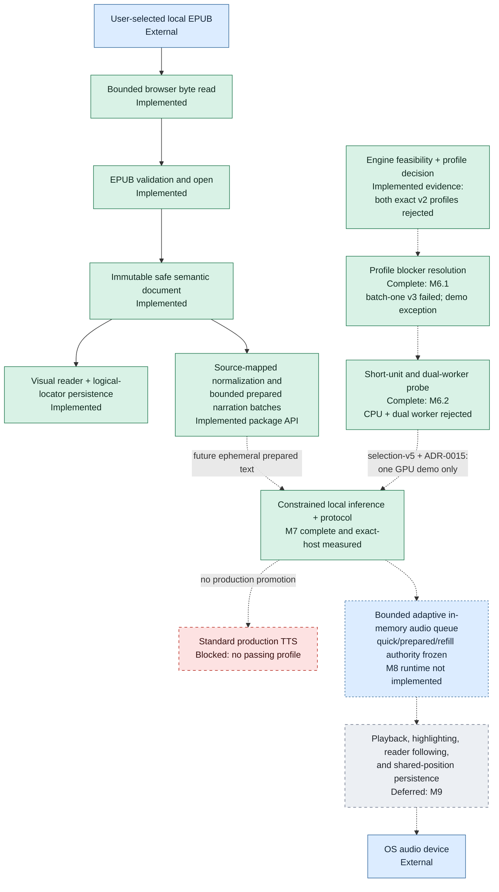

# Canonical system diagram

## Purpose and evidence rule

This is VoxLeaf's canonical high-level system map. It distinguishes running product behavior from repository foundations and approved or deferred work. A type, fake, scaffold, ADR, or plan is not implementation evidence by itself. Statuses here are based on production code plus the validation recorded in completed plans; future nodes appear only when accepted architecture or the roadmap supports them.

For detailed rationale and invariants, see the [architecture overview](overview.md). For milestone authority, see the [roadmap](../plans/roadmap.md) and [completed plans](../plans/completed/README.md).

## Status legend

| Status               | Meaning                                                                                                           |
| -------------------- | ----------------------------------------------------------------------------------------------------------------- |
| **Implemented**      | Production code exists for the stated boundary and repository validation covers it.                               |
| **In progress**      | Active implementation evidence exists, but the approved boundary is not complete.                                 |
| **Approved planned** | An accepted decision or approved roadmap milestone authorizes the work; production implementation is not claimed. |
| **Blocked**          | A required decision or prerequisite is missing or failed, so implementation is not authorized.                    |
| **Deferred**         | The roadmap places the work after the next approved milestone or its design remains intentionally unresolved.     |
| **Foundation only**  | A scaffold, contract, fake, or shell exists without the runtime behavior its area will eventually own.            |
| **External**         | A user-, operating-system-, or hardware-owned boundary outside the repository.                                    |

Solid arrows are implemented runtime or package relationships. Dashed arrows are approved planned, blocked, or deferred relationships and must not be read as working data flow.

## Current status snapshot

| Area                                                     | Status                                  | Repository-backed boundary                                                                                                                                                                                                                                                                                                                                               |
| -------------------------------------------------------- | --------------------------------------- | ------------------------------------------------------------------------------------------------------------------------------------------------------------------------------------------------------------------------------------------------------------------------------------------------------------------------------------------------------------------------ |
| Desktop visual reader                                    | **Implemented**                         | Local byte selection, publication lifecycle, safe semantic React rendering, navigation, reflow, preferences, logical-locator tracking, and bounded restoration.                                                                                                                                                                                                          |
| EPUB ingestion                                           | **Implemented**                         | Bounded in-memory open, archive/package/navigation validation, immutable safe semantics, lazy bounded raster access, and deterministic locators.                                                                                                                                                                                                                         |
| Narration preparation                                    | **Implemented**                         | `@voxleaf/epub` exposes bounded, cancellable, locator-linked `OpenedPublication.prepareNarration` batches. The desktop has no production caller.                                                                                                                                                                                                                         |
| Shared contracts and fakes                               | **Implemented**                         | Versioned contracts, runtime decoders, conformance fixtures, deterministic fakes, and the closed protocol-v1 control family exist. They do not implement real TTS, playback, or synchronization.                                                                                                                                                                         |
| Tauri native shell                                       | **Implemented**                         | Completed M007 implements and validates the narrow binary-response boundary, persistent child supervision, framed standard streams, fixed timeouts, process-tree termination, zero automatic restart, typed commands, native-only exact-service activation, measured handoff diagnostics, and exit cleanup. No plugin, general shell capability, or listener is granted. |
| Python TTS area                                          | **Implemented**                         | Completed M007 implements and validates the offline framed service, bounded fake engine, common one-active adapter boundary, exact development-only Qwen/Serena adapter, and content-safe exact-host measurement runner. Default tests remain model-free.                                                                                                                |
| TTS feasibility and profile decision                     | **Implemented**                         | The bounded candidate-neutral `v2` harness measured both exact profiles. The license/offline/packaging audit is complete; limited one-evaluator quality remains non-promotable; ADR-0013 selects neither profile. This is development evidence, not runtime behavior.                                                                                                    |
| TTS profile blocker resolution                           | **Complete; standard blocker retained** | The exact Serena `v3` matrix failed startup, throughput, zero-failure, and mid-generation cancellation. `selection-v5` retains the standard blocker and ADR-0015 permits one exact GPU worker only for a bounded adaptive development demo. No passing standard or general hardware profile exists.                                                                      |
| Short-unit and dual-worker feasibility                   | **Complete; alternatives rejected**     | Milestone 6.2 rejects shared batching, targeted tokenizer placement, CPU-only generation, and dual-worker scheduling. The official concurrent arm stopped at `resource-limit`; a later low-load diagnostic completed but improved aggregate RTF by only about 2.6% while substantially slowing the GPU worker. Local and required PR validation pass.                    |
| Constrained local TTS service and process protocol       | **Implemented**                         | Completed M007 validates frozen transport limits, canonical contracts, bounded Python service, native supervision, typed desktop consumption, one-unit ownership, exact Qwen/Serena integration, model-free packaged evidence, and measured exact-host handoff/cancellation/cleanup. Product narration, the multi-unit queue, and playback belong to M008.               |
| Standard production TTS profile and distribution         | **Blocked**                             | ADR-0013 still selects no passing standard profile. Continuous playback, CPU fallback, general hardware support, model/runtime distribution, and production graduation require later evidence and decisions.                                                                                                                                                             |
| Adaptive audio scheduling and playback                   | **In progress**                         | M008 Milestone 1 freezes exact quick/prepared/refill thresholds, simultaneous frame/byte/unit/text/work limits, one-queue ownership, lifecycle, volume, `1.0x` speed, boundary-wait choices, and truthful UX language. No production queue, player, caller, or scheduler exists.                                                                                         |
| Synchronization, hardware support, and release packaging | **Deferred**                            | Milestones 9–11 remain future work; no production dependency or general hardware claim exists.                                                                                                                                                                                                                                                                           |

## Component and trust-boundary map

```mermaid
flowchart LR
    classDef implemented fill:#d9f2e6,stroke:#247a52,color:#102a20
    classDef progress fill:#dcecff,stroke:#356aa0,color:#13253a,stroke-dasharray: 3 3
    classDef planned fill:#fff0c7,stroke:#9a6b00,color:#332400,stroke-dasharray: 5 5
    classDef blocked fill:#fde2e2,stroke:#b42318,color:#3a0d0d,stroke-dasharray: 5 5
    classDef deferred fill:#eceff3,stroke:#667085,color:#20242a,stroke-dasharray: 5 5
    classDef foundation fill:#e8e0f7,stroke:#6f4aa8,color:#241735
    classDef external fill:#dcecff,stroke:#356aa0,color:#13253a

    EPUB["Local EPUB selected by user<br/>External"]:::external
    AUDIO["OS audio device<br/>External; unused today"]:::external
    GPU["Exact configured CUDA GPU<br/>External development host"]:::external

    subgraph DEVICE["User device / local-only trust boundary"]
        subgraph DESKTOP["apps/desktop"]
            PICKER["Browser file input + FileReader<br/>Implemented"]:::implemented
            SESSION["Publication session owner<br/>Implemented"]:::implemented
            READER["Semantic React reader<br/>navigation, reflow, locator tracking<br/>Implemented"]:::implemented
            STORE["WebView localStorage<br/>locator + display preferences only<br/>Implemented"]:::implemented
            SHELL["Tauri native supervisor<br/>model-free default or native-configured exact child<br/>M7 complete"]:::implemented
            CLIENT["Typed TTS client + one-unit handoff sink<br/>M7 complete<br/>outside React; no product caller"]:::implemented
            PLAYBACK["Adaptive audio queue, player, backpressure<br/>M8 authority frozen; runtime not implemented"]:::progress
            SYNC["Playback/reader synchronization<br/>highlighting and following<br/>Deferred: M9"]:::deferred
        end

        subgraph PACKAGES["TypeScript packages"]
            EPUBCORE["@voxleaf/epub<br/>ingestion, safe semantics, rasters, locators<br/>Implemented"]:::implemented
            PREP["@voxleaf/epub narration preparation<br/>bounded locator-linked batches<br/>Implemented; no desktop caller"]:::implemented
            SHARED["@voxleaf/shared<br/>contracts, protocol-v1 control schema,<br/>generated validators and fixtures"]:::implemented
        end

        subgraph TTSAREA["services/tts and later local runtime"]
            PYTHON["Bounded Python protocol service<br/>fake + common one-active adapter boundary<br/>M7 complete"]:::implemented
            FAKE_CHILD["Supervised model-free Rust child<br/>framed stdio + synthetic complete unit<br/>M7 complete"]:::implemented
            QWEN["Exact Qwen/Serena adapter<br/>verified local artifacts + complete unit<br/>M7 Milestone 4 implemented; dev-only"]:::implemented
            FEASIBILITY["TTS feasibility harness + profile decision<br/>Implemented development evidence:<br/>both v2 roles rejected"]:::implemented
            PROFILE_CYCLE["TTS profile blocker resolution<br/>Complete: M6.1<br/>batch-one v3 failed; demo exception"]:::implemented
            BATCH_PROBE["Short-unit and dual-worker probe<br/>Complete: M6.2<br/>CPU + dual worker rejected"]:::implemented
            TTS["Constrained local TTS service + protocol<br/>M7 complete and exact-host measured"]:::implemented
            PROD_TTS["Standard production TTS profile<br/>Blocked: no passing profile"]:::blocked
        end
    end

    EPUB -->|"user grants bytes; no retained path"| PICKER
    PICKER -->|"bounded ArrayBuffer"| SESSION
    SESSION -->|"open/close"| EPUBCORE
    EPUBCORE -->|"safe semantic documents + resources"| READER
    READER -->|"validated locator + closed preferences"| STORE
    STORE -->|"same-byte identity restoration"| READER
    EPUBCORE -->|"package-internal safe source model"| PREP
    EPUBCORE -->|"locator and narration contracts"| SHARED
    SHELL --> READER
    CLIENT -->|"narrow typed invoke + binary response"| SHELL
    SHELL -->|"model-free default child"| FAKE_CHILD
    SHELL -->|"native-only exact configuration"| PYTHON
    SHARED -->|"typed control decoding"| CLIENT

    PYTHON -.-> FEASIBILITY
    FEASIBILITY -.-> PROFILE_CYCLE
    PROFILE_CYCLE -.-> BATCH_PROBE
    BATCH_PROBE -.->|"selection-v5 + ADR-0015:<br/>one GPU demo only"| TTS
    TTS -.->|"does not establish production viability"| PROD_TTS
    PREP -.->|"future ephemeral prepared text"| TTS
    SHARED -->|"generated protocol contracts"| PYTHON
    PYTHON -->|"model-free service evidence"| TTS
    PYTHON -->|"one active exact request"| QWEN
    QWEN -->|"local CUDA bfloat16/SDPA"| GPU
    QWEN -->|"validated complete unit"| TTS
    FAKE_CHILD -->|"supervised lifecycle evidence"| TTS
    CLIENT -->|"validated one-unit handoff"| TTS
    TTS -.->|"future buffered complete units"| PLAYBACK
    PLAYBACK -.-> AUDIO
    PLAYBACK -.-> SYNC
    SYNC -.-> READER
```

The diagram deliberately has no solid edge from the desktop session to narration preparation: the API is implemented and validated at the package boundary, but the production desktop does not call it. M007 Milestone 1 contains the Rust-owned synthetic child/std-stream and optimized binary-response probe. Milestone 2 adds the canonical control contracts and Python protocol loop. Milestone 3 adds the native supervisor, supervised model-free child, typed client, and one-unit sink used by packaged validation. Milestone 4 makes that supervisor start the exact Python/Qwen path only behind native-only development configuration. Milestone 5 measures complete-unit handoff, retained-unit backpressure, invalidation, process-tree termination, cleanup, and explicit reload on the exact host. The default path remains model-free, and there is still no product caller.

## EPUB-to-audio flow

```mermaid
flowchart TD
    classDef implemented fill:#d9f2e6,stroke:#247a52,color:#102a20
    classDef progress fill:#dcecff,stroke:#356aa0,color:#13253a,stroke-dasharray: 3 3
    classDef planned fill:#fff0c7,stroke:#9a6b00,color:#332400,stroke-dasharray: 5 5
    classDef blocked fill:#fde2e2,stroke:#b42318,color:#3a0d0d,stroke-dasharray: 5 5
    classDef deferred fill:#eceff3,stroke:#667085,color:#20242a,stroke-dasharray: 5 5
    classDef external fill:#dcecff,stroke:#356aa0,color:#13253a

    FILE["User-selected local EPUB<br/>External"]:::external
    READ["Bounded browser byte read<br/>Implemented"]:::implemented
    OPEN["EPUB validation and open<br/>Implemented"]:::implemented
    SAFE["Immutable safe semantic document<br/>Implemented"]:::implemented
    VISUAL["Visual reader + logical-locator persistence<br/>Implemented"]:::implemented
    PREP["Source-mapped normalization and<br/>bounded prepared narration batches<br/>Implemented package API"]:::implemented
    PROFILE["Engine feasibility + profile decision<br/>Implemented evidence:<br/>both exact v2 profiles rejected"]:::implemented
    NEXT_PROFILE["Profile blocker resolution<br/>Complete: M6.1<br/>batch-one v3 failed; demo exception"]:::implemented
    BATCH_PROBE["Short-unit and dual-worker probe<br/>Complete: M6.2<br/>CPU + dual worker rejected"]:::implemented
    INFER["Constrained local inference + protocol<br/>M7 complete and exact-host measured"]:::implemented
    PROD["Standard production TTS<br/>Blocked: no passing profile"]:::blocked
    BUFFER["Bounded adaptive in-memory audio queue<br/>quick/prepared/refill authority frozen<br/>M8 runtime not implemented"]:::progress
    FOLLOW["Playback, highlighting, reader following,<br/>and shared-position persistence<br/>Deferred: M9"]:::deferred
    DEVICE["OS audio device<br/>External"]:::external

    FILE --> READ --> OPEN --> SAFE --> VISUAL
    SAFE --> PREP
    PREP -.->|"future ephemeral prepared text"| INFER
    PROFILE -.-> NEXT_PROFILE
    NEXT_PROFILE -.-> BATCH_PROBE
    BATCH_PROBE -.->|"selection-v5 + ADR-0015:<br/>one GPU demo only"| INFER
    INFER -.->|"no production promotion"| PROD
    INFER -.-> BUFFER
    BUFFER -.-> FOLLOW
    FOLLOW -.-> DEVICE
```

The current user-visible flow ends at `VISUAL`. `PREP` is usable by package callers and tests but is not wired into the desktop. `NEXT_PROFILE` and `BATCH_PROBE` are completed development evidence. Accepted `selection-v5` rejects CPU-only and dual-worker scheduling and retains the exact GPU candidate only for ADR-0015's constrained demo. Completed M007 provides the model-free transport, protocol authority, canonical contracts, Python service, native supervisor, typed client, one-unit handoff, exact development-only Qwen/Serena adapter, measured exact-host handoff/cancellation/cleanup matrix, and repository decision audit. M008 Milestone 1 now freezes the model-independent buffer and UX authority: 10-second low water, 15-second quick start, one-minute refill, explicit 1/2/5/10-minute preparation, exact simultaneous bounds, and `1.0x`-only playback. Audible product runtime still does not exist, and no production engine is selected. The 30-minute in-memory value is a simultaneous ceiling, not a startup target or uninterrupted-playback guarantee.

## Privacy, persistence, cancellation, and bounds

- EPUB bytes, safe semantic content, and derived narration text remain inside the local-device trust boundary.
- Only versioned logical reading locators, exact-byte publication identity, and closed display preferences are persisted. EPUB bytes, narration text, model output, and generated audio are not persisted by default.
- The durable reading position is a stable EPUB logical locator, never a rendered page number.
- Implemented ingestion, raster access, reader rendering, and persistence limits are documented in the [architecture overview](overview.md) and their accepted ADRs. Narration preparation has a separate [accepted limits profile](narration-preparation-limits-v1.md).
- Implemented publication, preparation, and constrained inference work supports cancellation and close. Future product narration dispatch, queues, buffering, and playback must propagate identity-first invalidation and reject stale session or generation work across every boundary. Playback-only pause may continue bounded same-identity generation; explicit stop and invalidating actions still cancel obsolete work.
- The frozen M008 authority bounds the future queue by 43,200,000 sample frames, 172,800,000 logical payload bytes, 256 complete units/metadata entries, one prepared batch, 16 prepared segments, inherited narration-v1 text totals, one active synthesis, and zero service-queued synthesis. Underruns, intentional boundary waits, startup latency, preparation progress, playable depth, real-time factor, memory, and cancellation latency remain content-free measurements.
- Network TTS and remote book processing remain outside the product boundary.

## Evidence and decision authority

| Boundary                                               | Primary evidence                                                                                                                                                                                                                                                                                                                                                                                                                                                                                                                                                                                                                                                                        |
| ------------------------------------------------------ | --------------------------------------------------------------------------------------------------------------------------------------------------------------------------------------------------------------------------------------------------------------------------------------------------------------------------------------------------------------------------------------------------------------------------------------------------------------------------------------------------------------------------------------------------------------------------------------------------------------------------------------------------------------------------------------- |
| Workspace foundation                                   | [Milestone 1 completed plan](../plans/completed/M001-engineering-foundation.md), [ADR-0005](decisions/ADR-0005-engineering-workspace-and-quality-tooling.md)                                                                                                                                                                                                                                                                                                                                                                                                                                                                                                                            |
| Contracts and fakes                                    | [Milestone 2 completed plan](../plans/completed/M002-shared-contracts-and-test-harness.md), [ADR-0006](decisions/ADR-0006-json-schema-contract-authority.md)                                                                                                                                                                                                                                                                                                                                                                                                                                                                                                                            |
| Secure EPUB ingestion and locator model                | [Milestone 3 completed plan](../plans/completed/M003-secure-epub-ingestion-and-document-model.md), [ADR-0007](decisions/ADR-0007-secure-epub-ingestion-boundary.md), [ADR-0003](decisions/ADR-0003-stable-reading-locators.md)                                                                                                                                                                                                                                                                                                                                                                                                                                                          |
| Visual reader and local restoration                    | [Milestone 4 completed plan](../plans/completed/M004-reflowable-visual-reader-and-position-restoration.md), [ADR-0008](decisions/ADR-0008-visual-reader-architecture.md), [ADR-0011](decisions/ADR-0011-bounded-web-storage-reader-state.md)                                                                                                                                                                                                                                                                                                                                                                                                                                            |
| Native Windows startup evidence                        | [Milestone 4 native smoke closeout](../plans/completed/M004-001-native-webdriver-startup-smoke.md)                                                                                                                                                                                                                                                                                                                                                                                                                                                                                                                                                                                      |
| Narration preparation                                  | [Milestone 5 completed plan](../plans/completed/M005-narration-text-preparation.md), [ADR-0012](decisions/ADR-0012-bounded-narration-preparation.md), [narration normalization](narration-normalization-v1.md)                                                                                                                                                                                                                                                                                                                                                                                                                                                                          |
| Playable-audio startup and adaptive buffering policy   | [ADR-0004](decisions/ADR-0004-start-after-audio-lead.md), [ADR-0015](decisions/ADR-0015-bounded-adaptive-qwen-demo-buffering.md), frozen [adaptive buffer v1 authority](adaptive-buffer-authority-v1.md), and [M008](../plans/active/M008-bounded-adaptive-prebuffering.md). Milestone 1 arithmetic evidence exists; product runtime remains unimplemented.                                                                                                                                                                                                                                                                                                                             |
| Local TTS feasibility authority                        | [Milestone 6 completed plan](../plans/completed/M006-local-tts-feasibility-and-engine-profiles.md), [current v2 feasibility profile](tts-feasibility-profile-v2.md), [selection matrix](../../benchmarks/tts/selection-v2.md), and [ADR-0013](decisions/ADR-0013-no-viable-local-tts-engine-profile.md); both exact roles rejected and no production profile selected                                                                                                                                                                                                                                                                                                                   |
| Local TTS profile blocker resolution                   | [Milestone 6.1 completed plan](../plans/completed/M006-001-local-tts-profile-blocker-resolution.md), [Serena intake result](../../benchmarks/tts/customvoice-spanish-screen-result-v2.json), machine-readable [`profile-v3.json`](../../benchmarks/tts/profile-v3.json), [v3 authority](tts-feasibility-profile-v3.md), [passing exact-host prototype result](../../benchmarks/tts/incremental-cancellation-prototype-result-v1.json), [candidate-neutral `selection-v3`](../../benchmarks/tts/selection-v3.md), historical [ADR-0014](decisions/ADR-0014-constrained-qwen-development-demo.md), and superseding [ADR-0015](decisions/ADR-0015-bounded-adaptive-qwen-demo-buffering.md) |
| Short-unit and dual-worker feasibility                 | [Milestone 6.2 completed plan](../plans/completed/M006-002-qwen-short-segment-batch-feasibility.md), [v4 authority](tts-feasibility-profile-v4.md), both stopped `v4` results, accepted [`selection-v4`](../../benchmarks/tts/selection-v4.md), frozen [v5 authority](tts-feasibility-profile-v5.md), schema-valid [`v5` CPU admission](../../benchmarks/tts/dual-worker-result-v5-cpu-solo.json), schema-valid [`v5` GPU baseline](../../benchmarks/tts/dual-worker-result-v5-gpu-solo.json), the completed-plan diagnostic record, and accepted [`selection-v5`](../../benchmarks/tts/selection-v5.md). CPU and dual-worker scheduling are rejected; no product runtime exists.       |
| Constrained local TTS service and process protocol     | [M007 completed ExecPlan](../plans/completed/M007-local-tts-service-and-process-protocol.md), accepted frozen [protocol v1 authority](tts-service-protocol-v1.md), accepted [ADR-0016](decisions/ADR-0016-rust-owned-stdio-tts-protocol.md), and the schema-valid [exact-host handoff result](../../benchmarks/tts/service-handoff-result-v1-exact-host.json). M007 validates transport, canonical contracts, Python service, native supervision, typed client, exact Qwen/Serena integration, model-free packaged evidence, and measured exact-host delivery/backpressure/invalidation/termination/cleanup/reload evidence.                                                            |
| Local-first desktop and future local process direction | [ADR-0001](decisions/ADR-0001-local-first-desktop.md); ADR-0015 permits a constrained one-GPU development demo while the production profile and distribution boundary remain unresolved                                                                                                                                                                                                                                                                                                                                                                                                                                                                                                 |
| Roadmap status                                         | [Roadmap](../plans/roadmap.md)                                                                                                                                                                                                                                                                                                                                                                                                                                                                                                                                                                                                                                                          |

## Remaining gates

1. **Milestone 8 — In progress:** Milestone 1 freezes the exact adaptive-buffer and UX authority. Continue M008 with deterministic scheduler traces, then implement the product narration caller, bounded multi-unit audio ownership, one-GPU scheduling, quick/prepared startup, playback-only pause continuation, adaptive boundary waits, truthful frontier buffering, and the 30-minute ceiling. Consume M007 protocol v1 without adding a service-side queue or automatic retry.
2. **Milestone 9 — Deferred:** connect one stable logical position across the visual reader, prepared narration, playback progress, highlighting, following, seek, and restoration.
3. **Milestones 10–11 — Deferred:** validate hardware profiles and CPU fallback, then complete installer/signing/distribution and full MVP closeout.

Update this document whenever a major component boundary, process/package dependency, trust boundary, persistence owner, external interaction, runtime flow, or roadmap implementation status changes. A completed plan may advance a node or arrow only when its definition of done and validation evidence are present.
