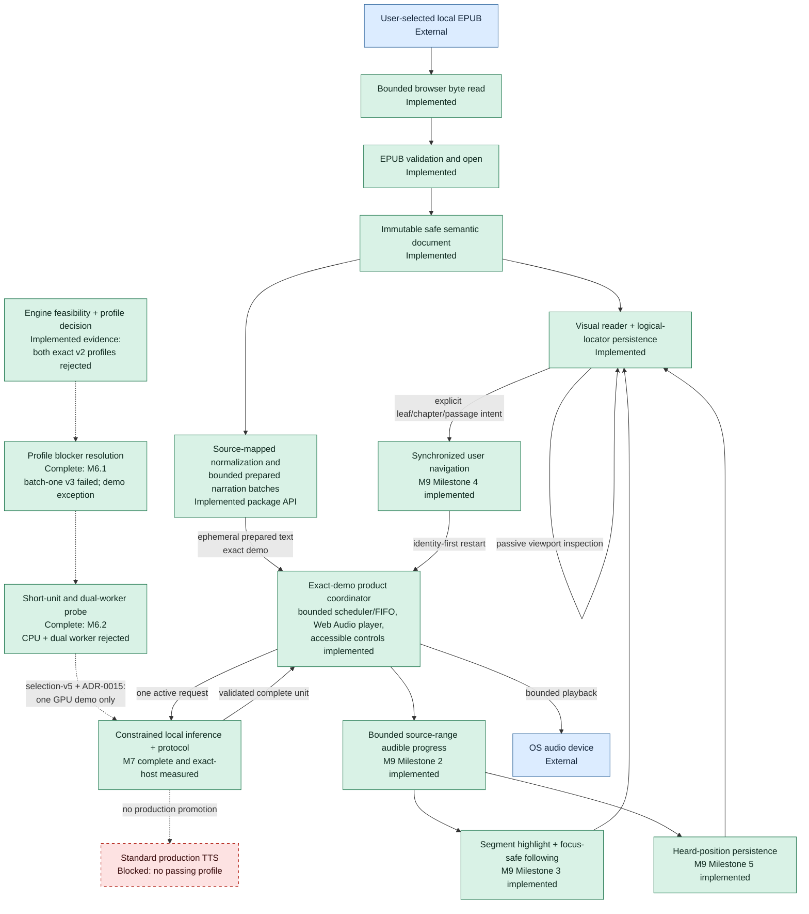

# Canonical system diagram

## Purpose and evidence rule

This is VoxLeaf's canonical high-level system map. It distinguishes running product behavior from repository foundations and approved or deferred work. A type, fake, scaffold, ADR, or plan is not implementation evidence by itself. Statuses here are based on production code plus the validation recorded in completed plans; future nodes appear only when accepted architecture or the roadmap supports them.

For detailed rationale and invariants, see the [architecture overview](overview.md). For milestone authority, see the [roadmap](../plans/roadmap.md) and [completed plans](../plans/completed/README.md).

## Status legend

| Status               | Meaning                                                                                                           |
| -------------------- | ----------------------------------------------------------------------------------------------------------------- |
| **Implemented**      | Production code exists for the stated boundary and repository validation covers it.                               |
| **In progress**      | Active implementation evidence exists, but the approved boundary is not complete.                                 |
| **Approved planned** | An accepted decision or approved roadmap milestone authorizes the work; production implementation is not claimed. |
| **Blocked**          | A required decision or prerequisite is missing or failed, so implementation is not authorized.                    |
| **Deferred**         | The roadmap places the work after the next approved milestone or its design remains intentionally unresolved.     |
| **Foundation only**  | A scaffold, contract, fake, or shell exists without the runtime behavior its area will eventually own.            |
| **External**         | A user-, operating-system-, or hardware-owned boundary outside the repository.                                    |

Solid arrows are implemented runtime or package relationships. Dashed arrows are approved planned, blocked, or deferred relationships and must not be read as working data flow.

## Current status snapshot

| Area                                               | Status                                                                                      | Repository-backed boundary                                                                                                                                                                                                                                                                                                                                                                                                                                                                                                                                                                                                                                                                                                                                                                                                                                                                                                                                                                                                                        |
| -------------------------------------------------- | ------------------------------------------------------------------------------------------- | ------------------------------------------------------------------------------------------------------------------------------------------------------------------------------------------------------------------------------------------------------------------------------------------------------------------------------------------------------------------------------------------------------------------------------------------------------------------------------------------------------------------------------------------------------------------------------------------------------------------------------------------------------------------------------------------------------------------------------------------------------------------------------------------------------------------------------------------------------------------------------------------------------------------------------------------------------------------------------------------------------------------------------------------------- |
| Desktop visual reader                              | **Implemented**                                                                             | Local byte selection, publication lifecycle, safe semantic React rendering, navigation, reflow, preferences, logical-locator tracking, and bounded restoration.                                                                                                                                                                                                                                                                                                                                                                                                                                                                                                                                                                                                                                                                                                                                                                                                                                                                                   |
| EPUB ingestion                                     | **Implemented**                                                                             | Bounded in-memory EPUB 3 open, archive/package/XHTML-navigation validation, immutable safe semantics, lazy bounded raster access, and deterministic locators.                                                                                                                                                                                                                                                                                                                                                                                                                                                                                                                                                                                                                                                                                                                                                                                                                                                                                      |
| EPUB 2/NCX compatibility                           | **Approved planned**                                                                        | ADR-0048 and active Milestone 3.1 authorize one bounded OPF 2.0/NCX path through the same internal semantic/navigation model. No production implementation or support claim exists yet; M011 Milestone 7 waits for its validated result.                                                                                                                                                                                                                                                                                                                                                                                                                                                                                                                                                                                                                                                                                                                                              |
| Narration preparation                              | **Implemented**                                                                             | `@voxleaf/epub` exposes bounded, cancellable, locator-linked `OpenedPublication.prepareNarration` batches. The exact-development coordinator calls it from the active or settled navigation locator.                                                                                                                                                                                                                                                                                                                                                                                                                                                                                                                                                                                                                                                                                                                                                                                                                                              |
| Shared contracts and fakes                         | **Implemented**                                                                             | Versioned contracts, runtime decoders, conformance fixtures, deterministic fakes, the closed protocol-v1 control family, and the M010 privacy-safe host-profile compatibility report exist. M010 Milestone 2 produces and decodes that report across the narrow native-to-desktop boundary; Milestone 3 consumes it without changing the shared contract or TTS protocol.                                                                                                                                                                                                                                                                                                                                                                                                                                                                                                                                                                                                                                                                         |
| Tauri native shell                                 | **Implemented**                                                                             | Completed M007 implements and validates the narrow binary-response boundary, persistent child supervision, framed standard streams, fixed timeouts, process-tree termination, zero automatic restart, typed commands, native-only exact-service activation, measured handoff diagnostics, and exit cleanup. M010 Milestone 2 adds one bounded native host-report command using direct Windows APIs. No plugin, general shell capability, listener, or renderer hardware API is granted.                                                                                                                                                                                                                                                                                                                                                                                                                                                                                                                                                           |
| Python TTS area                                    | **Implemented**                                                                             | The offline framed service retains one active adapter and now implements exact Piper Spanish/English, Chatterbox Spanish/English, and development-only Qwen Serena/Spanish plus Aiden/English adapters. Default tests remain model-free; model-backed validation is sequential and exact-host only.                                                                                                                                                                                                                                                                                                                                                                                                                                                                                                                                                                                                                                                                                                                                               |
| TTS feasibility and profile decision               | **Implemented**                                                                             | The bounded candidate-neutral `v2` harness measured both exact profiles. The license/offline/packaging audit is complete; limited one-evaluator quality remains non-promotable; ADR-0013 selects neither profile. This is development evidence, not runtime behavior.                                                                                                                                                                                                                                                                                                                                                                                                                                                                                                                                                                                                                                                                                                                                                                             |
| TTS profile blocker resolution                     | **Complete; standard blocker retained**                                                     | The exact Serena `v3` matrix failed startup, throughput, zero-failure, and mid-generation cancellation. `selection-v5` retains the standard blocker and ADR-0015 permits one exact GPU worker only for a bounded adaptive development demo. No passing standard or general hardware profile exists.                                                                                                                                                                                                                                                                                                                                                                                                                                                                                                                                                                                                                                                                                                                                               |
| Short-unit and dual-worker feasibility             | **Complete; alternatives rejected**                                                         | Milestone 6.2 rejects shared batching, targeted tokenizer placement, CPU-only generation, and dual-worker scheduling. The official concurrent arm stopped at `resource-limit`; a later low-load diagnostic completed but improved aggregate RTF by only about 2.6% while substantially slowing the GPU worker. Local and required PR validation pass.                                                                                                                                                                                                                                                                                                                                                                                                                                                                                                                                                                                                                                                                                             |
| Constrained local TTS service and process protocol | **Implemented**                                                                             | Completed M007 validates frozen transport limits, canonical contracts, bounded Python service, native supervision, typed desktop consumption, one-unit ownership, exact Qwen/Serena integration, model-free packaged evidence, and measured exact-host handoff/cancellation/cleanup. Completed M008 consumes that boundary for bounded product narration and playback.                                                                                                                                                                                                                                                                                                                                                                                                                                                                                                                                                                                                                                                                            |
| Local TTS profiles and release distribution        | **Local profiles, verified Piper payload, and withheld Chatterbox acquisition implemented** | M010.1 implements supported Chatterbox Spanish/English plus language-matched Piper CPU profiles; Qwen Serena/Aiden remain development-only. M011 Milestone 3 builds the private embedded Piper Spanish-English core with complete notices/source and native verification. Milestones 4A-4B implement the native-owned optional Chatterbox lifecycle, exact six-file official model acquisition, and published reproducible split runtime while keeping availability withheld pending clean-host gates. ADR-0046 adds exact closure/path repair, short `cb/2`, removable `cb/cache`, allowlisted transient-cache repair, a metadata-guarded process-only verification receipt explicitly outside the malicious same-user tampering threat model, and conventional child paths without weakening canonical native containment. Both installed development-host language arms pass; restart, real package removal/reinstall, Piper-after-removal, clean-host, and public-signing gates remain. Qwen remains outside the first distributable product. |
| Adaptive audio scheduling and playback             | **Implemented and validated**                                                               | Completed M008 provides the frozen authority, scheduler, sole-owner payload FIFO, Web Audio player, preparation presenter, controls, exact-development application coordinator, measured packaged quick/prepared matrix, final demo policy, and passing required CI. M009 Milestone 2 adds bounded source-range projection without changing PCM ownership.                                                                                                                                                                                                                                                                                                                                                                                                                                                                                                                                                                                                                                                                                        |
| Boundary-aware audio transitions                   | **Implemented and validated**                                                               | Completed M008.1 reduces the completed prepared segment's semantic boundary to one bounded numeric delay and schedules at most one interruptible timer before an already-buffered successor. Hard/token splits remain continuous; real buffering replaces the delay; no silent PCM, model-input change, protocol field, or persistent data is added. Deterministic, portable, authoritative Windows, and replacement Ubuntu/Windows validation pass.                                                                                                                                                                                                                                                                                                                                                                                                                                                                                                                                                                                              |
| Reader/narration synchronization                   | **Implemented and validated**                                                               | Completed M009 implements the frozen segment authority, bounded content-free audible projection, one reader-owned Custom Highlight, focus-safe following, identity-first navigation, non-skipping heard-position persistence, passing exact-host proof, and repository/CI closeout.                                                                                                                                                                                                                                                                                                                                                                                                                                                                                                                                                                                                                                                                                                                                                               |
| Reader experience stabilization                    | **Complete and validated**                                                                  | Completed M009.1 repairs same-chapter active-range materialization; implements one reader scroll owner, stable compact chrome, collapsible narration detail, truthful loaded-duration text, and one bounded canonical paragraph leaf; and separates passive viewport inspection from explicit narration replacement. Deterministic, Chromium, packaged WebView2, private-EPUB, exact-host, repository, privacy, portable, and required Ubuntu/Windows checks pass.                                                                                                                                                                                                                                                                                                                                                                                                                                                                                                                                                                                |
| Hardware profiles, fallback, and resilience        | **Implemented and validated**                                                               | Completed M010 implements detection, matching, preference/recheck UI, identity-safe recovery, and exact Piper/davefx plus Qwen/Serena runtime gates. M010.1 Milestone 6 extends the immutable registry and pre-start configuration boundary to Piper/joe, Chatterbox bilingual, and Qwen/Aiden without automatic failover or a second child tree. Distribution stays with M011.                                                                                                                                                                                                                                                                                                                                                                                                                                                                                                                                                                                                                                                                   |
| Bilingual narration and candidate screening        | **Complete and validated**                                                                  | Completed M010.1 implements exact profile/language registry, matching, UI selection, pre-start configuration, native supervision, Piper English, Chatterbox bilingual, and Qwen Serena/Aiden bindings without changing protocol v1. Both Piper voices and Chatterbox are supported when exact gates pass; both Qwen voices remain development-only. Six service arms, six packaged EPUB portfolio arms, and required Ubuntu/Windows checks pass.                                                                                                                                                                                                                                                                                                                                                                                                                                                                                                                                                                                                  |
| Reader settings and playback controls              | **Complete and validated**                                                                  | Completed M010.2 bounds English-default language v2 plus narration-start v1 and playback-rate v1 preferences; implements the reader-first shell; and uses ADR-0040's repository WSOLA for six boundary-deferred rates without restarting TTS, discarding source PCM, adding a dependency, or expanding CSP. Milestone 6's six-arm packaged/repository checks, maintainer all-rate confirmation, and pull request #170 Ubuntu/Windows checks pass.                                                                                                                                                                                                                                                                                                                                                                                                                                                                                                                                                                                                 |
| Release packaging                                  | **M1-5 and 6A package paths implemented; clean-host and public-signing gates remain**       | M011 Milestones 2-3 close the production locks, audits, 400-component inventory, deterministic bilingual Piper payload, compliance bundle, measurements, and native verification. Milestones 4A-4B implement the withheld optional lifecycle, official model acquisition authority, and published split runtime. Milestone 5 builds the versioned `0.1.0` current-user NSIS installer with the exact Piper core. Milestone 6A implements truthful lifecycle feedback and two bounded uninstall data classes; focused tests and both development-host product-identity matrices pass. ADR-0045's validation package remains local-only and is not public or clean-host evidence.                                                                                                                                                                                                                                                                                                                                                                   |

## Component and trust-boundary map

```mermaid
flowchart LR
    classDef implemented fill:#d9f2e6,stroke:#247a52,color:#102a20
    classDef progress fill:#dcecff,stroke:#356aa0,color:#13253a,stroke-dasharray: 3 3
    classDef planned fill:#fff0c7,stroke:#9a6b00,color:#332400,stroke-dasharray: 5 5
    classDef blocked fill:#fde2e2,stroke:#b42318,color:#3a0d0d,stroke-dasharray: 5 5
    classDef deferred fill:#eceff3,stroke:#667085,color:#20242a,stroke-dasharray: 5 5
    classDef foundation fill:#e8e0f7,stroke:#6f4aa8,color:#241735
    classDef external fill:#dcecff,stroke:#356aa0,color:#13253a

    EPUB["Local EPUB selected by user<br/>External"]:::external
    AUDIO["OS audio device<br/>External; exact demo connected"]:::external
    GPU["Exact configured CUDA GPU<br/>External development host"]:::external
    HOST["Local OS, CPU, RAM, GPU, and providers<br/>External host facts"]:::external
    SIGN["Trusted Windows signing authority<br/>External; public installer only"]:::external
    HF_MODEL_SOURCE["Official ResembleAI/chatterbox model data<br/>full Hugging Face revision + six files;<br/>external acquisition only"]:::external
    CHATTERBOX_RUNTIME_SOURCE["Reviewed Chatterbox runtime origin<br/>exact 79-package graph + three measured parts;<br/>published as chatterbox-runtime-v2"]:::implemented
    PACKAGE["Windows x64 per-user NSIS installer<br/>M11 M5: VoxLeaf 0.1.0 + Piper ES/EN;<br/>normal Chatterbox manifest withheld"]:::progress
    VALIDATION_PACKAGE["Separate unsigned validation installer<br/>ADR-0045: distinct identity + data root;<br/>local compatible-host use only"]:::progress
    RELEASE_GRAPH["Release locks + audit + inventory<br/>M11 M2-M4B deterministic boundary;<br/>400 components + explicit blind spots"]:::implemented

    subgraph DEVICE["User device / local-only trust boundary"]
        subgraph DESKTOP["apps/desktop"]
            PICKER["Browser file input + FileReader<br/>Implemented"]:::implemented
            SESSION["Publication session owner<br/>Implemented"]:::implemented
            READER["Semantic React reader<br/>navigation, reflow, locator tracking<br/>Implemented"]:::implemented
            STORE["WebView localStorage<br/>locator + display + bounded language/profile/start/rate preferences<br/>Implemented"]:::implemented
            SHELL["Tauri native supervisor<br/>model-free default or native-configured exact child<br/>M7 complete"]:::implemented
            CLIENT["Typed TTS client + one-unit handoff sink<br/>M7 complete<br/>consumed outside React"]:::implemented
            PLAYBACK["Product narration coordinator + adaptive scheduler<br/>source-PCM FIFO, Web Audio + boundary WSOLA;<br/>effective lead + source-frame progress;<br/>semantic unit-transition timer"]:::implemented
            PROJECTION["Bounded audible range projection<br/>exact start/completion + played frames<br/>M9 complete"]:::implemented
            SYNC["Reader segment projection, following,<br/>and synchronized user navigation<br/>M9 complete; M9.1 M2 materialization repair"]:::implemented
            HEARD_STORE["Heard-position persistence bridge<br/>exact boundaries + lifecycle flush<br/>M9 complete"]:::implemented
            STABILIZE["Reader experience stabilization<br/>highlight repair + fixed reader viewport;<br/>compact narration + bounded leaf + passive isolation<br/>M9.1 complete"]:::implemented
            COMPAT["Privacy-safe detector + measured matcher<br/>exact language/profile registry, bounded preference,<br/>UI + hardware pre-start check"]:::implemented
            RUNTIME_GATE["Exact-profile runtime configuration gate<br/>native boolean at availability + pre-start<br/>M10 Milestone 6 corrective validation"]:::implemented
            RECOVERY["Identity-safe recovery controller<br/>verified cleanup + one explicit restart<br/>M10 Milestone 4 implemented"]:::implemented
            SETTINGS_PREFS["Bounded narration preferences<br/>English fallback + Quick/Prepared start + playback rate<br/>M10.2 M3/M5 implemented"]:::implemented
            SETTINGS_SHELL["Reader-first app bar + Settings<br/>compact chrome + contents overlay;<br/>M10.2 M4 implemented"]:::implemented
            SPEED_CONTROL["Six-value boundary-deferred playback speed<br/>selected/pending/active state;<br/>M10.2 M5 implemented"]:::implemented
            WSOLA["Repository incremental WSOLA v3<br/>one reusable bounded worklet;<br/>M10.2 M5 implemented"]:::implemented
            ACQUISITION["Native optional-profile lifecycle<br/>M11 M4B multi-artifact controller implemented;<br/>normal withheld; validation build enabled"]:::progress
        end

        subgraph PACKAGES["TypeScript packages"]
            EPUBCORE["@voxleaf/epub<br/>ingestion, safe semantics, rasters, locators<br/>Implemented"]:::implemented
            PREP["@voxleaf/epub narration preparation<br/>narration-v1 + bilingual-v2 + Piper-v2 + Chatterbox-v1<br/>locator-linked + model-output bounded"]:::implemented
            SHARED["@voxleaf/shared<br/>contracts, protocol-v1 control + host-profile schemas,<br/>generated validators and fixtures"]:::implemented
        end

        subgraph TTSAREA["services/tts and later local runtime"]
            PYTHON["Bounded Python protocol service<br/>fake + common one-active adapter boundary<br/>M7 complete"]:::implemented
            FAKE_CHILD["Supervised model-free Rust child<br/>framed stdio + synthetic complete unit<br/>M7 complete"]:::implemented
            QWEN["Exact Qwen Serena/Aiden adapter<br/>Spanish/English language binding<br/>complete unit; development-only"]:::implemented
            PIPER["Exact Piper davefx/joe CPU adapter<br/>Spanish/English language binding<br/>24-kHz complete unit; supported"]:::implemented
            CHATTERBOX["Exact Chatterbox bilingual CUDA adapter<br/>Spanish/English; 3,644-MiB measured peak<br/>6-GB-class gate; 8 GB recommended"]:::implemented
            FEASIBILITY["TTS feasibility harness + profile decision<br/>Implemented development evidence:<br/>both v2 roles rejected"]:::implemented
            PROFILE_CYCLE["TTS profile blocker resolution<br/>Complete: M6.1<br/>batch-one v3 failed; demo exception"]:::implemented
            BATCH_PROBE["Short-unit and dual-worker probe<br/>Complete: M6.2<br/>CPU + dual worker rejected"]:::implemented
            TTS["Constrained local TTS service + protocol<br/>M7 complete and exact-host measured"]:::implemented
            PROD_TTS["Verified Piper core payload<br/>M11 M3: private CPython/Piper + ES/EN voices;<br/>notices, exact source, manifest + measurements"]:::implemented
            CHATTERBOX_PACKAGE["Optional Chatterbox GPU profile<br/>official model + immutable split runtime;<br/>corrected cb/2 tree + removable cb/cache;<br/>withheld pending clean-host/release gates"]:::progress
            CPU_FALLBACK["Piper davefx/joe CPU family<br/>Spanish/English supported;<br/>packaged portfolio passed"]:::implemented
            BILINGUAL["Bilingual preparation + exact selection<br/>M10.1 complete; local + required CI pass"]:::implemented
        end
    end

    EPUB -->|"user grants bytes; no retained path"| PICKER
    PICKER -->|"bounded ArrayBuffer"| SESSION
    SESSION -->|"open/close"| EPUBCORE
    EPUBCORE -->|"safe semantic documents + resources"| READER
    READER -->|"validated locator + closed preferences"| STORE
    STORE -->|"same-byte identity restoration"| READER
    EPUBCORE -->|"package-internal safe source model"| PREP
    EPUBCORE -->|"locator and narration contracts"| SHARED
    SHELL --> READER
    CLIENT -->|"narrow typed invoke + binary response"| SHELL
    SHELL -->|"model-free default child"| FAKE_CHILD
    SHELL -->|"native-only exact configuration"| PYTHON
    SHARED -->|"typed control decoding"| CLIENT
    HOST -->|"direct bounded content-free facts"| COMPAT
    COMPAT -->|"hardware-compatible selected profile"| RUNTIME_GATE
    COMPAT -->|"exact compatible language/profile records"| BILINGUAL
    RUNTIME_GATE -->|"exact runtime configured"| PLAYBACK
    PLAYBACK -.->|"classified failure + invalidated identity"| RECOVERY
    RECOVERY -.->|"explicit bounded restart after cleanup"| SHELL
    SETTINGS_PREFS -->|"language v2 + start/rate v1"| STORE
    SETTINGS_PREFS -->|"language/profile filter + reset"| COMPAT
    SETTINGS_SHELL -->|"reader preferences through existing reflow owner"| READER
    SETTINGS_SHELL -->|"language/profile + measured detail views"| COMPAT
    SETTINGS_SHELL -.->|"consent, progress, activation, removal"| ACQUISITION
    SPEED_CONTROL -->|"six-rate boundary state"| PLAYBACK
    WSOLA -->|"pitch-preserving successor-unit playback"| PLAYBACK

    PYTHON -.-> FEASIBILITY
    FEASIBILITY -.-> PROFILE_CYCLE
    PROFILE_CYCLE -.-> BATCH_PROBE
    BATCH_PROBE -.->|"selection-v5 + ADR-0015:<br/>one GPU demo only"| TTS
    TTS -->|"production service closure"| PROD_TTS
    CPU_FALLBACK -->|"M11 baseline release family"| PROD_TTS
    RELEASE_GRAPH -->|"closed core identity"| PROD_TTS
    RELEASE_GRAPH -->|"separately gated optional identity"| CHATTERBOX_PACKAGE
    SHELL -->|"versioned desktop + release resources"| PACKAGE
    SHELL -->|"compile-time validation feature"| VALIDATION_PACKAGE
    PROD_TTS -->|"verified private Piper core + both voices"| PACKAGE
    VALIDATION_PACKAGE -.->|"explicit consent; no bundled Chatterbox bytes"| ACQUISITION
    SHELL -->|"fixed manifest/file/hash verification"| PROD_TTS
    SIGN -.->|"required only for public publication"| PACKAGE
    HF_MODEL_SOURCE -.->|"full commit + six exact files;<br/>size/SHA-256 verified"| ACQUISITION
    CHATTERBOX_RUNTIME_SOURCE -.->|"separate immutable runtime manifest"| ACQUISITION
    ACQUISITION -.->|"digest-verified atomic install"| CHATTERBOX_PACKAGE
    CHATTERBOX_PACKAGE -.->|"installed exact runtime/model"| CHATTERBOX
    CPU_FALLBACK -->|"v6 admitted profile"| PIPER
    PYTHON -->|"one active exact request"| PIPER
    PIPER -->|"bounded 24-kHz complete unit"| TTS
    PYTHON -->|"one active exact request"| CHATTERBOX
    CHATTERBOX -->|"local CUDA bfloat16"| GPU
    CHATTERBOX -->|"bounded 24-kHz complete unit"| TTS
    PREP -->|"ephemeral prepared text + semantic boundary;<br/>exact demo only"| PLAYBACK
    PREP -->|"versioned Spanish/English preparation"| BILINGUAL
    BILINGUAL -->|"one exact language-bound profile"| PYTHON
    SHARED -->|"generated protocol contracts"| PYTHON
    PYTHON -->|"model-free service evidence"| TTS
    PYTHON -->|"one active exact request"| QWEN
    QWEN -->|"local CUDA bfloat16/SDPA"| GPU
    QWEN -->|"validated complete unit"| TTS
    FAKE_CHILD -->|"supervised lifecycle evidence"| TTS
    CLIENT -->|"validated one-unit handoff"| TTS
    PLAYBACK -->|"one typed request at a time"| CLIENT
    TTS -->|"validated takeAudioUnit transfer"| PLAYBACK
    PLAYBACK -->|"bounded Web Audio playback"| AUDIO
    PLAYBACK -->|"content-free identities,<br/>source range + played frames"| PROJECTION
    PROJECTION --> SYNC
    SYNC -->|"semantic range highlight +<br/>focus-safe placement"| READER
    READER -->|"explicit leaf/chapter/passage intent"| SYNC
    READER -->|"passive viewport inspection"| READER
    SYNC -->|"identity-first cancel + restart"| PLAYBACK
    SYNC -->|"existing range + locator authority"| STABILIZE
    PLAYBACK -->|"existing content-free status"| STABILIZE
    STABILIZE -->|"fixed shell + compact status"| READER
    PROJECTION -->|"exact segment checkpoints"| HEARD_STORE
    HEARD_STORE -->|"bounded locator state only"| STORE
```

M008 Milestone 5 adds the solid exact-demo path from active publication
preparation through the application coordinator, M007 client/service, bounded
FIFO, and Web Audio device. Native configuration must explicitly select the
exact Qwen/Serena child; the model-free default cannot expose a fake
user-facing narration path. M009 Milestone 2 adds the solid playback-to-
projection edge: source ranges remain immutable and eligible only with their
FIFO units, and exact/bounded observations contain no narration text or PCM.
M008.1 reduces that ephemeral semantic boundary to one numeric transition
delay before the prepared text reference is dropped. The timer stays inside
the desktop playback node; it creates no new service, package, protocol,
persistence, or external-device edge.
The M010.1 node now includes implemented product selection and preparation
flow: the closed persisted language joins the generation configuration,
canonical text is normalized through `narration-bilingual-v2`; Piper and
Chatterbox then apply their exact bounded packing profiles, and an invalid
profile/language pair is rejected before child start. Milestone 6 makes the
admitted edges solid: Piper davefx/Spanish, Piper joe/English, and Chatterbox
Spanish/English are supported exact bindings; Qwen Serena/Spanish and
Aiden/English are development-only exact bindings. One native-owned service
tree and protocol v1 remain unchanged. The six-arm exact-host service matrix
and six packaged synthetic EPUB portfolio arms pass locally. Piper English
composes bilingual normalization with Piper-v2 expansion-aware sizing. Pull
request #159 passed the required Ubuntu/Windows checks and merged the M010.1
closeout.

The M011 installer path is now implemented. Milestones 4A-4B implement the fail-closed
optional lifecycle and multi-artifact acquisition controller but keep its
network manifest withheld. Milestones 2-3
implement the repository dependency identity and the standalone core payload:
the private Piper core has an exact 15-entry lock, the Chatterbox option has a
separate 79-package lock, and one release audit/inventory boundary records 400
components plus explicit audit blind spots. The deterministic core combines
the production service, private CPython/Piper runtime, two voices, notices,
model cards, and exact source archives. Milestone 5 packages that exact core,
release notices, inventory, optional-acquisition authority, and user guide in a
versioned `0.1.0` current-user Windows x64 NSIS installer. The measured unsigned
installer is `181,654,713` bytes with SHA-256
`9dcc7fea72dd3d4eefd3ae79c8045f968328e5fde0a29d25c244a12b8169473c`.
Local install, first start, repair, uninstall, unrelated-file preservation, and
Defender observation pass; clean-host behavior remains Milestone 6 evidence.
Chatterbox's implemented local adapter
gains a distribution edge only through the separate optional profile after
explicit user consent, a native-owned fixed manifest, bounded staging,
per-artifact digest verification, atomic versioned installation, clean-host GPU
proof, and application-owned removal. Milestone 4B splits that edge:
exactly six model-data files come from full revision
`5bb1f6ee58e50c3b8d408bc82a6d3740c2db6e18` of the official
`ResembleAI/chatterbox` Hugging Face repository, while the locked runtime comes
from a separately frozen, reproducibly measured three-part GitHub Release
origin. The controller is implemented with sequential bounded transfers,
closed redirects, verification, cleanup, and atomic promotion; the runtime
assets are published, but clean-host validation is incomplete, so Download
remains unavailable. Model repository
code is never executed, and a model-only transfer is not an installed profile. Selecting an
absent profile does not download or replace active narration; successful
installation is followed by separate explicit activation. Qwen has no M011
distribution edge. The external signing edge applies only to publishing a
general Windows installer. Its credential-isolated automation and signature
verification are implemented, but no authorized certificate is available, so
this artifact remains an unsigned local portfolio candidate.

The M010.2 preference node is now an implemented runtime relationship.
Milestone 3 adds bounded language v2 and narration-start v1 storage, preserves
valid saved Spanish/English, defaults safe fallback/reset cases to English,
hydrates controls before use without model start, and routes explicit reset
through the existing identity-first configuration-stop path. It adds no audio,
book identity, locator, host detail, or playback-rate state to persistence.

The M010.2 Settings node is now an implemented runtime relationship. Milestone
4 composes the reader, preference, compatibility, and narration owners through
one fixed compact app bar and a five-section accessible Settings drawer/sheet.
It adds no new locator, host-detection, profile, or playback authority. The
contents overlay remains navigation-only, the publication viewport remains the
sole reading scroll owner, and opening/closing Settings is lifecycle-neutral.

The M010.2 speed node is now a solid runtime relationship. Milestone 1
froze its lifecycle-neutral Settings, bounded preferences, English fallback
migration, exact source/effective-duration arithmetic, backend candidates,
pitch/resource gates, and unchanged cancellation/resource boundaries before
results. Milestone 2 selected no backend and ADR-0034 retained `1.00x` for that
v1 result. ADR-0035 authorized and
ADR-0036 froze the separate six-rate, fee-free v2 authority. ADR-0037 records
that no candidate survived the complete gate sequence; every dependency,
candidate adapter, runner, and prospective `media-src 'self' blob:` delta was
removed. ADR-0038 authorizes a new result-blind v3 in which a speed selection
becomes active only at the next complete-unit boundary while TTS and queued PCM
continue unchanged. ADR-0039 and the immutable v3 authority now freeze exactly
the media and repository-WSOLA candidates, selected/pending/active state,
250 ms recurring handoff, resource/lifecycle, listening, licence/CSP, and
strict lineage gates before Milestone 2D. Milestone 2D then selected repository
WSOLA after the complete
machine, privacy, lifecycle, and bilingual-listening sequence. ADR-0040 retains
only that controller/worklet and no CSP or dependency change. Milestone 5 makes
its product edge solid: one reusable worklet applies the latest valid pending
rate at the next complete-unit boundary, effective duration governs lead, and
source frames/bytes continue to govern memory and audible progress.
M009 Milestone 3 makes the projection-to-reader edge solid: the reader maps
the active source range, owns one production Custom Highlight entry, and
performs focus-safe placement without creating passive-seek feedback. The
M009 Milestone 4 makes the reader-to-synchronization-to-playback loop solid:
explicit leaf, chapter, visible-passage, and stable-boundary placement waits
for containment, and only prior active play intent restarts. M009.1 exact-host
validation amends the loop so passive viewport inspection preserves the active
narration identity, highlight, and play intent while retargeting the
contextual leaf as a selectable visual-line or pointer-hover preview. The overall
M009 Milestone 5 makes the projection-to-persistence path solid: exact starts
save segment starts, matching completions advance to range ends, and bounded
interruption/lifecycle flushes retain the latest heard checkpoint without
periodic writes or reflow regression. M009 Milestone 6 validates the packaged
loop on the exact host. Milestone 7 closes repository, privacy,
documentation, and required pull-request validation. The synchronization area
is complete within the constrained exact-development boundary.

M009.1 Milestones 1-2 strengthen the implemented synchronization-to-reader
path: paint-aware proof distinguishes registry acceptance from visible
rendering, and a missing same-chapter DOM range issues the existing one-shot
canonical materialization request before mapper refresh. Milestone 3 makes the
stabilization edges solid: one reader root owns EPUB scrolling, compact
application/publication/narration chrome stays outside it, narration detail
can collapse, and exact loaded/target/estimate text replaces the progress bar.
Locator sampling, reflow/restoration, highlight following, and packaged proofs
share that root. Milestone 4 adds one application-owned leaf anchored through
the existing semantic range mapper. It routes a canonical block-start locator
through identity-first replacement and settled reader placement, while bounded
preview/preparing/audible/checkpoint state reinforces progress. It adds no
publication DOM controls, protocol field, buffer policy, persistence shape, or
exact segment text-range authority. Milestone 5 validates the corrected
private-EPUB and exact-host interaction, and Milestone 6 closes repository,
privacy, portable, packaged, and required pull-request validation.

The M010 host-to-compatibility and compatibility-to-playback edges are now
solid.
Milestone 2 implements one native-owned, single-concurrency Windows probe and
the typed desktop decoder for the canonical report frozen in Milestone 1.
Direct OS, DXGI, DirectML, and CUDA driver APIs are normalized before crossing
Tauri; adapter identity and raw errors are discarded, and unsupported
platforms return unavailable. Milestone 3 matches only immutable measured
entries with fixed safety margins, keeps raw facts transient, persists only a
bounded profile ID, and rechecks immediately before the product coordinator
may issue the typed child-start request. Corrective Milestone 6 validation adds
a separate native boolean gate derived from exact-runtime construction during
product availability and again before child start. Hardware compatibility can
therefore remain true while Play is disabled because local runtime
configuration is absent; no path, environment value, or raw error crosses the
boundary. M010.1 Milestone 6 expands the executable registry to exact
language-bound Piper davefx/Spanish, Piper joe/English, Chatterbox
Spanish/English, Qwen Serena/Spanish, and Qwen Aiden/English profiles. Both
Piper voices and Chatterbox are supported; both Qwen voices remain
development-only. Profile selection stops and invalidates current narration
before one new native configuration can start; only one service tree exists.
The recovery edge is now solid. Milestone 4
implements the
closed failure taxonomy, identity-first teardown, bounded PCM cleanup
completion, zero-owner verification, latest-heard resume, one explicit
restart, terminal containment, and profile/recheck episode reset. The
authority keeps host facts separate from engine `CapabilityReportV1`; no
automatic retry or second service tree is admitted. Milestone 5 passes every
frozen Piper v6 gate. Milestone 6 integrates the verified isolated Piper
adapter, converts its complete 22,050-Hz waveform to the protocol's bounded
24,000-Hz mono unit, and passes the exact-host service and packaged adaptive
Piper arms with zero GPU use and zero generated-audio persistence. Piper
product dispatch first applies the `narration-piper-v2` code-point, byte,
sentence, and spoken-expansion limits, preserving complete text and contiguous
locator ranges while bounding ordinary prose and compact speech-expanding
forms before protocol v1's 20-second ceiling. It then omits only
punctuation-only Piper units that cannot produce a waveform; no silence or
stale audio is inserted, and continuation advances to the next speakable
locator-linked unit. Other profiles retain `narration-v1`. The Qwen
service arm passes under its interpreter firewall rule. Its packaged path now
admits the native-gated development profile at `7,196` MiB total and `6,508`
MiB currently available VRAM and executes inference; the later depletion
synchronization assertion still fails, preserving the development-only claim.
M010 Milestone 7 added no runtime edge and closed its historical matrix.
M010.1 Milestone 6 now layers the implemented v2 matrix over it. Language-
matched Piper is the lightweight CPU path, Chatterbox is the supported
bilingual GPU path, both Qwen voices remain explicit development-only, and
historical rejected profiles remain unavailable. Fallback does not mean
automatic failover, and M011 owns distributable runtime/model packaging and
license fulfillment.

## EPUB-to-audio flow

```mermaid
flowchart TD
    classDef implemented fill:#d9f2e6,stroke:#247a52,color:#102a20
    classDef progress fill:#dcecff,stroke:#356aa0,color:#13253a,stroke-dasharray: 3 3
    classDef planned fill:#fff0c7,stroke:#9a6b00,color:#332400,stroke-dasharray: 5 5
    classDef blocked fill:#fde2e2,stroke:#b42318,color:#3a0d0d,stroke-dasharray: 5 5
    classDef deferred fill:#eceff3,stroke:#667085,color:#20242a,stroke-dasharray: 5 5
    classDef external fill:#dcecff,stroke:#356aa0,color:#13253a

    FILE["User-selected local EPUB<br/>External"]:::external
    READ["Bounded browser byte read<br/>Implemented"]:::implemented
    OPEN["EPUB validation and open<br/>Implemented"]:::implemented
    SAFE["Immutable safe semantic document<br/>Implemented"]:::implemented
    VISUAL["Visual reader + logical-locator persistence<br/>Implemented"]:::implemented
    PREP["Source-mapped normalization and<br/>bounded prepared narration batches<br/>Implemented package API"]:::implemented
    PROFILE["Engine feasibility + profile decision<br/>Implemented evidence:<br/>both exact v2 profiles rejected"]:::implemented
    NEXT_PROFILE["Profile blocker resolution<br/>Complete: M6.1<br/>batch-one v3 failed; demo exception"]:::implemented
    BATCH_PROBE["Short-unit and dual-worker probe<br/>Complete: M6.2<br/>CPU + dual worker rejected"]:::implemented
    INFER["Constrained local inference + protocol<br/>M7 complete and exact-host measured"]:::implemented
    PROD["Standard production TTS<br/>Blocked: no passing profile"]:::blocked
    BUFFER["Exact-demo product coordinator<br/>bounded scheduler/FIFO, Web Audio player,<br/>accessible controls implemented"]:::implemented
    AUDIBLE["Bounded source-range audible progress<br/>M9 Milestone 2 implemented"]:::implemented
    FOLLOW["Segment highlight + focus-safe following<br/>M9 Milestone 3 implemented"]:::implemented
    INTERACTION["Synchronized user navigation<br/>M9 Milestone 4 implemented"]:::implemented
    HEARD["Heard-position persistence<br/>M9 Milestone 5 implemented"]:::implemented
    DEVICE["OS audio device<br/>External"]:::external

    FILE --> READ --> OPEN --> SAFE --> VISUAL
    SAFE --> PREP
    PREP -->|"ephemeral prepared text<br/>exact demo"| BUFFER
    PROFILE -.-> NEXT_PROFILE
    NEXT_PROFILE -.-> BATCH_PROBE
    BATCH_PROBE -.->|"selection-v5 + ADR-0015:<br/>one GPU demo only"| INFER
    INFER -.->|"no production promotion"| PROD
    BUFFER -->|"one active request"| INFER
    INFER -->|"validated complete unit"| BUFFER
    BUFFER --> AUDIBLE
    AUDIBLE --> FOLLOW
    FOLLOW --> VISUAL
    VISUAL -->|"explicit leaf/chapter/passage intent"| INTERACTION
    VISUAL -->|"passive viewport inspection"| VISUAL
    INTERACTION -->|"identity-first restart"| BUFFER
    AUDIBLE --> HEARD
    HEARD --> VISUAL
    BUFFER -->|"bounded playback"| DEVICE
```

The exact-development user flow now continues from `VISUAL` through `PREP`,
`BUFFER`, `INFER`, and `DEVICE`. The application coordinator starts at the
active narration locator, retains at most one bounded prepared batch, dispatches
one synthesis at a time, and transfers sole complete-unit ownership into the
player. The M009 packaged matrix proves synchronized quick and one-minute
prepared audio while measuring six segment transitions, one natural
underrun/refill, 190 ms cancellation, and 378.46 buffering seconds per playback
minute.
The solid edges include the content-free audible projection, its segment-level
reader highlight/follow consumer, and the explicit synchronized seek/restart
loop. Passive viewport inspection stays within the visual reader and does not
enter that loop. Exact audible boundary persistence and bounded lifecycle
flushes are now solid as well. Exact-host synchronization and required
repository/pull-request evidence pass. The
path remains a constrained exact-host demo, not a standard engine,
continuous-playback guarantee, or general hardware profile. The 30-minute
value remains a simultaneous ceiling, not a startup target.

## Privacy, persistence, cancellation, and bounds

- EPUB bytes, safe semantic content, and derived narration text remain inside the local-device trust boundary.
- Only versioned logical reading locators, exact-byte publication identity, and closed display preferences are persisted. EPUB bytes, narration text, model output, and generated audio are not persisted by default.
- The durable reading position is a stable EPUB logical locator, never a rendered page number.
- Implemented ingestion, raster access, reader rendering, and persistence limits are documented in the [architecture overview](overview.md) and their accepted ADRs. Narration preparation has a separate [accepted limits profile](narration-preparation-limits-v1.md).
- Implemented publication, preparation, constrained inference, and low-level playback work supports cancellation and close within each current boundary. M009 Milestone 4 now propagates identity-first invalidation from user navigation through playback stop, preparation abort, queued-unit release, active-synthesis containment, settled placement, and authorized restart. Playback-only pause may continue bounded same-identity generation; navigation preserves paused intent at its target, while explicit stop and replacement cancel obsolete work.
- The frozen M008 authority bounds the implemented FIFO by 43,200,000 sample frames, 172,800,000 logical payload bytes, 256 complete units/metadata entries, one prepared batch, 16 prepared segments, inherited narration-v1 text totals, one active synthesis, and zero service-queued synthesis. The Web Audio backend adds only one transient active-unit device buffer bounded by the 20-second service-unit maximum. Underruns, intentional boundary waits, startup latency, preparation progress, playable depth, real-time factor, memory, and cancellation latency remain content-free measurements.
- M008.1 retains only one closed numeric transition delay with an eligible
  audio unit. It schedules no audio payload, contributes zero playable frames,
  advances audible projection only when the next unit starts, and cancels the
  one pending timer during identity-first invalidation.
- Network TTS and remote book processing remain outside the product boundary.
- The supervised Python child has exact-profile, protocol, allocation,
  identity, and process-tree containment but retains the ordinary filesystem
  and network authority of the current user. It is not an OS sandbox. M011
  owns the minimum shipped graph, no-manual-firewall distribution, integrity,
  clean-host privacy, and truthful release claim.

## Evidence and decision authority

| Boundary                                                | Primary evidence                                                                                                                                                                                                                                                                                                                                                                                                                                                                                                                                                                                                                                                                                                                                                                                                                                                                                                                                                                                                                                                                                                                                                                                                                                                                                                                                                                                                                                                                 |
| ------------------------------------------------------- | -------------------------------------------------------------------------------------------------------------------------------------------------------------------------------------------------------------------------------------------------------------------------------------------------------------------------------------------------------------------------------------------------------------------------------------------------------------------------------------------------------------------------------------------------------------------------------------------------------------------------------------------------------------------------------------------------------------------------------------------------------------------------------------------------------------------------------------------------------------------------------------------------------------------------------------------------------------------------------------------------------------------------------------------------------------------------------------------------------------------------------------------------------------------------------------------------------------------------------------------------------------------------------------------------------------------------------------------------------------------------------------------------------------------------------------------------------------------------------- |
| Workspace foundation                                    | [Milestone 1 completed plan](../plans/completed/M001-engineering-foundation.md), [ADR-0005](decisions/ADR-0005-engineering-workspace-and-quality-tooling.md)                                                                                                                                                                                                                                                                                                                                                                                                                                                                                                                                                                                                                                                                                                                                                                                                                                                                                                                                                                                                                                                                                                                                                                                                                                                                                                                     |
| Contracts and fakes                                     | [Milestone 2 completed plan](../plans/completed/M002-shared-contracts-and-test-harness.md), [ADR-0006](decisions/ADR-0006-json-schema-contract-authority.md)                                                                                                                                                                                                                                                                                                                                                                                                                                                                                                                                                                                                                                                                                                                                                                                                                                                                                                                                                                                                                                                                                                                                                                                                                                                                                                                     |
| Secure EPUB ingestion and locator model                 | [Milestone 3 completed plan](../plans/completed/M003-secure-epub-ingestion-and-document-model.md), [ADR-0007](decisions/ADR-0007-secure-epub-ingestion-boundary.md), and [ADR-0003](decisions/ADR-0003-stable-reading-locators.md) are the implemented EPUB 3 authority. Accepted [ADR-0048](decisions/ADR-0048-admit-bounded-epub2-and-ncx-compatibility.md) and the [active Milestone 3.1 plan](../plans/active/M003-001-bounded-epub2-and-ncx-compatibility.md) authorize but do not yet implement the additive OPF 2.0/NCX profile.                                                                                                                                                                                                                                                                                                                                                                                                                                                                                                                                                                                                                                                                                                                                                                                                                                                                                                                                                                                   |
| Visual reader and local restoration                     | [Milestone 4 completed plan](../plans/completed/M004-reflowable-visual-reader-and-position-restoration.md), [ADR-0008](decisions/ADR-0008-visual-reader-architecture.md), [ADR-0011](decisions/ADR-0011-bounded-web-storage-reader-state.md)                                                                                                                                                                                                                                                                                                                                                                                                                                                                                                                                                                                                                                                                                                                                                                                                                                                                                                                                                                                                                                                                                                                                                                                                                                     |
| Native Windows startup evidence                         | [Milestone 4 native smoke closeout](../plans/completed/M004-001-native-webdriver-startup-smoke.md)                                                                                                                                                                                                                                                                                                                                                                                                                                                                                                                                                                                                                                                                                                                                                                                                                                                                                                                                                                                                                                                                                                                                                                                                                                                                                                                                                                               |
| Narration preparation                                   | [Milestone 5 completed plan](../plans/completed/M005-narration-text-preparation.md), [ADR-0012](decisions/ADR-0012-bounded-narration-preparation.md), [narration normalization](narration-normalization-v1.md)                                                                                                                                                                                                                                                                                                                                                                                                                                                                                                                                                                                                                                                                                                                                                                                                                                                                                                                                                                                                                                                                                                                                                                                                                                                                   |
| Playable-audio startup and adaptive buffering policy    | [ADR-0004](decisions/ADR-0004-start-after-audio-lead.md), [ADR-0015](decisions/ADR-0015-bounded-adaptive-qwen-demo-buffering.md), frozen [adaptive buffer v1 authority](adaptive-buffer-authority-v1.md), and [completed M008](../plans/completed/M008-bounded-adaptive-prebuffering.md). M008 provides authority, scheduler, sole-owner payload buffering, Web Audio playback, estimates/wait decisions, controls, the exact-development application caller, measured packaged quick/prepared evidence, and final validation.                                                                                                                                                                                                                                                                                                                                                                                                                                                                                                                                                                                                                                                                                                                                                                                                                                                                                                                                                   |
| Boundary-aware generated-unit transitions               | [M008.1 completed ExecPlan](../plans/completed/M008-001-boundary-aware-audio-transitions.md), frozen [playback transition policy v1](playback-transition-pause-policy-v1.md), and accepted [ADR-0021](decisions/ADR-0021-boundary-aware-audio-transitions.md). Deterministic, portable, authoritative Windows, privacy/repository, relative-link, and replacement required Ubuntu/Windows validation pass.                                                                                                                                                                                                                                                                                                                                                                                                                                                                                                                                                                                                                                                                                                                                                                                                                                                                                                                                                                                                                                                                       |
| Local TTS feasibility authority                         | [Milestone 6 completed plan](../plans/completed/M006-local-tts-feasibility-and-engine-profiles.md), [current v2 feasibility profile](tts-feasibility-profile-v2.md), [selection matrix](../../benchmarks/tts/selection-v2.md), and [ADR-0013](decisions/ADR-0013-no-viable-local-tts-engine-profile.md); both exact roles rejected and no production profile selected                                                                                                                                                                                                                                                                                                                                                                                                                                                                                                                                                                                                                                                                                                                                                                                                                                                                                                                                                                                                                                                                                                            |
| Local TTS profile blocker resolution                    | [Milestone 6.1 completed plan](../plans/completed/M006-001-local-tts-profile-blocker-resolution.md), [Serena intake result](../../benchmarks/tts/customvoice-spanish-screen-result-v2.json), machine-readable [`profile-v3.json`](../../benchmarks/tts/profile-v3.json), [v3 authority](tts-feasibility-profile-v3.md), [passing exact-host prototype result](../../benchmarks/tts/incremental-cancellation-prototype-result-v1.json), [candidate-neutral `selection-v3`](../../benchmarks/tts/selection-v3.md), historical [ADR-0014](decisions/ADR-0014-constrained-qwen-development-demo.md), and superseding [ADR-0015](decisions/ADR-0015-bounded-adaptive-qwen-demo-buffering.md)                                                                                                                                                                                                                                                                                                                                                                                                                                                                                                                                                                                                                                                                                                                                                                                          |
| Short-unit and dual-worker feasibility                  | [Milestone 6.2 completed plan](../plans/completed/M006-002-qwen-short-segment-batch-feasibility.md), [v4 authority](tts-feasibility-profile-v4.md), both stopped `v4` results, accepted [`selection-v4`](../../benchmarks/tts/selection-v4.md), frozen [v5 authority](tts-feasibility-profile-v5.md), schema-valid [`v5` CPU admission](../../benchmarks/tts/dual-worker-result-v5-cpu-solo.json), schema-valid [`v5` GPU baseline](../../benchmarks/tts/dual-worker-result-v5-gpu-solo.json), the completed-plan diagnostic record, and accepted [`selection-v5`](../../benchmarks/tts/selection-v5.md). CPU and dual-worker scheduling are rejected; no standard product runtime is selected.                                                                                                                                                                                                                                                                                                                                                                                                                                                                                                                                                                                                                                                                                                                                                                                  |
| Constrained local TTS service and process protocol      | [M007 completed ExecPlan](../plans/completed/M007-local-tts-service-and-process-protocol.md), accepted frozen [protocol v1 authority](tts-service-protocol-v1.md), accepted [ADR-0016](decisions/ADR-0016-rust-owned-stdio-tts-protocol.md), and the schema-valid [exact-host handoff result](../../benchmarks/tts/service-handoff-result-v1-exact-host.json). M007 validates transport, canonical contracts, Python service, native supervision, typed client, exact Qwen/Serena integration, model-free packaged evidence, and measured exact-host delivery/backpressure/invalidation/termination/cleanup/reload evidence.                                                                                                                                                                                                                                                                                                                                                                                                                                                                                                                                                                                                                                                                                                                                                                                                                                                     |
| Reader/narration synchronization                        | [M009 completed ExecPlan](../plans/completed/M009-synchronized-reading-and-narration.md), frozen [synchronization authority v1](synchronization-authority-v1.md), and accepted [ADR-0017](decisions/ADR-0017-segment-level-reader-narration-synchronization.md). Milestones 1-7 implement and validate the authority/proof, bounded audible projection, reader highlight/follow consumer, identity-first synchronized navigation, non-skipping heard persistence, exact-host packaged proof, and repository/CI closeout.                                                                                                                                                                                                                                                                                                                                                                                                                                                                                                                                                                                                                                                                                                                                                                                                                                                                                                                                                         |
| Reader experience stabilization                         | [M009.1 completed ExecPlan](../plans/completed/M009-001-reader-experience-stabilization.md), frozen [reader-experience authority v1](reader-experience-authority-v1.md), and accepted [ADR-0018](decisions/ADR-0018-reader-experience-stabilization.md). The highlight repair, fixed shell, compact narration, truthful loaded-duration text, bounded paragraph leaf, and passive-scroll isolation are implemented and validated. Pull request #142 passed required Ubuntu/Windows checks and merged the closeout.                                                                                                                                                                                                                                                                                                                                                                                                                                                                                                                                                                                                                                                                                                                                                                                                                                                                                                                                                               |
| Hardware profiles, fallback, and operational resilience | [M010 completed ExecPlan](../plans/completed/M010-hardware-profiles-fallback-and-operational-resilience.md), frozen [hardware/profile/recovery authority v1](hardware-profile-recovery-authority-v1.md), accepted [ADR-0019](decisions/ADR-0019-privacy-safe-hardware-profiles-and-recovery.md), passing [Piper v6 result](../../benchmarks/tts/cpu-fallback-result-v6.json), [selection-v6](../../benchmarks/tts/selection-v6.md), [ADR-0020](decisions/ADR-0020-admit-piper-cpu-fallback.md), corrective [Qwen development VRAM authority v1](qwen-development-vram-admission-v1.md) and [ADR-0022](decisions/ADR-0022-qwen-development-vram-admission.md), final [support matrix v1](tts-support-matrix-v1.md) and [ADR-0023](decisions/ADR-0023-final-m010-support-and-recovery.md), implemented [Piper narration preparation profile v2](piper-narration-preparation-profile-v2.md), and frozen [runtime-configuration availability v1](tts-profile-runtime-configuration-availability-v1.md). Final support, margins, explicit fallback/recovery, limitations, distribution obligations, local validation, and replacement Ubuntu/Windows checks pass.                                                                                                                                                                                                                                                                                                                     |
| Bilingual narration and candidate screening             | [M010.1 completed ExecPlan](../plans/completed/M010-001-bilingual-narration-and-candidate-screening.md), implemented [bilingual product authority v1](bilingual-narration-authority-v1.md) and [normalization v2](narration-normalization-v2.md), frozen [v12 evaluation profile](tts-feasibility-profile-v12.md), content-safe [Chatterbox bilingual](../../benchmarks/tts/chatterbox-bilingual-full-result-v12.json), [Qwen Serena Spanish](../../benchmarks/tts/qwen-serena-spanish-quality-result-v12.json), and [Qwen Aiden English](../../benchmarks/tts/qwen-aiden-english-quality-result-v12.json) results, accepted [selection v12](../../benchmarks/tts/selection-v12.md), [ADR-0031](decisions/ADR-0031-admit-chatterbox-bilingual-and-qwen-language-profiles.md), and current [support/integration matrix v2](tts-support-matrix-v2.md). Milestone 6 implements the exact language/profile service bindings while preserving protocol v1 and one-tree ownership. Milestone 7 validates all six packaged EPUB portfolio arms, exact-host metrics, synchronization, cancellation, bounded cleanup, privacy, zero external requests, and required Ubuntu/Windows checks.                                                                                                                                                                                                                                                                                                |
| Reader settings and playback controls                   | [M010.2 completed ExecPlan](../plans/completed/M010-002-reader-settings-and-playback-controls.md), approved [product requirements](../product/reader-settings-and-playback-controls.md), immutable [authority v1](reader-settings-playback-authority-v1.md), frozen playback [authority v2](reader-settings-playback-authority-v2.md) and [v3](reader-settings-playback-authority-v3.md), implemented [bilingual preference authority v2](bilingual-narration-authority-v2.md), ADR-0033 through WSOLA-selection ADR-0040, and aggregate [v3 result](../../benchmarks/playback/boundary-deferred-v3-result.json). English-default language/start/rate preferences, the reader-first shell, boundary-deferred six-rate WSOLA playback, and the sequential six-arm portfolio are implemented and validated. Maintainer all-rate confirmation and pull request #170 Ubuntu/Windows checks pass.                                                                                                                                                                                                                                                                                                                                                                                                                                                                                                                                                                                     |
| MVP packaging and release                               | [Active M011 ExecPlan](../plans/active/M011-package-validate-and-release-mvp.md), frozen historical [release authority v1](mvp-release-authority-v1.md), additive [Chatterbox acquisition authority v2](chatterbox-official-acquisition-authority-v2.md), accepted [ADR-0042](decisions/ADR-0042-freeze-mvp-release-authority.md), [ADR-0043](decisions/ADR-0043-freeze-verified-official-chatterbox-acquisition.md), and [ADR-0044](decisions/ADR-0044-use-measured-capacity-for-chatterbox-vram-admission.md), [release security/distribution boundary](../development/release-security-and-distribution.md), exact [component inventory](../../services/tts/release/component-inventory-v1.json), [Piper package evidence](../../services/tts/release/core/core-package-evidence-v1.json), [Windows package evidence](../../apps/desktop/src-tauri/release/windows-package-evidence-v1.json), and [Chatterbox runtime evidence](../../services/tts/release/optional/chatterbox/runtime-package-evidence-v2.json). Milestones 1-3 freeze the topology, close dependency/audit scope, and implement the verified bilingual Piper payload. Milestones 4A-4B implement the withheld lifecycle plus exact official model/split-runtime acquisition and public runtime identity. Milestone 5 builds the versioned local NSIS package and passes its development-host lifecycle/Defender checks; clean-host optional/product evidence and trusted public signing remain future work. |
| Local-first desktop and future local process direction  | [ADR-0001](decisions/ADR-0001-local-first-desktop.md); ADR-0015 permits a constrained one-GPU development demo, M010/M010.1 implement exact local profiles, and M011 owns their narrower distributable payload                                                                                                                                                                                                                                                                                                                                                                                                                                                                                                                                                                                                                                                                                                                                                                                                                                                                                                                                                                                                                                                                                                                                                                                                                                                                   |
| Roadmap status                                          | [Roadmap](../plans/roadmap.md)                                                                                                                                                                                                                                                                                                                                                                                                                                                                                                                                                                                                                                                                                                                                                                                                                                                                                                                                                                                                                                                                                                                                                                                                                                                                                                                                                                                                                                                   |

## Remaining gates

1. **Milestone 9 — Complete:** all seven M009 milestones are implemented,
   exact-host validated, and covered by passing required Ubuntu and Windows
   pull-request checks.
2. **Milestone 9.1 — Complete:** the
   [reader-experience authority v1](reader-experience-authority-v1.md) and
   [ADR-0018](decisions/ADR-0018-reader-experience-stabilization.md) are
   implemented. Deterministic, Chromium, release-packaged WebView2,
   private-EPUB, exact-host, repository, privacy, portable, and required
   Ubuntu/Windows validation pass.
3. **Milestone 8.1 — Complete:** the frozen semantic transition policy,
   deterministic desktop implementation, bounded clean-runner stabilization,
   and replacement Ubuntu/Windows checks pass.
4. **Milestone 10 — Complete:** the final support matrix, ADR, exact safety
   margins, explicit fallback/recovery policy, runtime/license boundary,
   limitations, local validation, and replacement Ubuntu/Windows checks pass.
5. **Milestone 10.1 — Complete:** Milestones 1/1A-6 freeze and execute the
   bilingual evaluation, implement explicit preparation/selection, and
   integrate exact Piper Spanish/English, Chatterbox Spanish/English, and
   development-only Qwen Serena/Spanish plus Aiden/English service paths.
   Milestone 7's local packaged portfolio journeys and final metrics/privacy
   evidence pass; pull request #159 passed required Ubuntu/Windows checks and
   merged the closeout.
6. **Milestone 10.2 — Complete:** v1 authority and
   comparison select no backend and retain `1.00x`. ADR-0035 authorizes a
   separate reduced-range, fee-free v2, and ADR-0036 freezes its six rates,
   candidates, licence/CSP policy, resource gates, and validation before
   results. ADR-0037 records that v2 also selects none after inference
   contention and removes every experiment. ADR-0038 authorizes a separate
   boundary-deferred v3; ADR-0039 froze its exact result-blind authority before
   Milestone 2D candidate work. ADR-0040 selects repository WSOLA after every
   frozen v3 gate passes. Milestone 3 implements the bounded English-default
   language/start preference runtime. Milestone 4 implements the fixed compact
   app bar, sole reader viewport, contents overlay, and accessible Settings
   drawer/sheet. Milestone 5 implements the selected backend connection,
   boundary-deferred rate state, playback preference, and effective lead.
   Milestone 6's six packaged profile/language arms, complete local repository
   checks, maintainer all-rate confirmation, and required pull-request checks
   pass.
7. **Milestone 3.1 — Approved planned:** ADR-0048 and the active ExecPlan
   authorize a bounded OPF 2.0/NCX parser path through the existing semantic,
   locator, reader, restoration, and narration owners. Production code and
   acceptance evidence do not exist yet; current builds remain EPUB 3-only.
8. **Milestone 11 — In progress:** Milestone 1 freezes the exact minimum
   Windows/Piper payload, optional Chatterbox topology, threat model, cleanup,
   and independent release claims. Milestone 2 closes shipped/downloadable
   dependency identity, audit policy, bounded update intake, and the exact
   component inventory. Milestone 3 implements the compliant deterministic,
   manifest-verified Piper runtime and bilingual voice distribution with exact
   notices/source evidence. Milestone 4A implements the withheld optional
   Chatterbox lifecycle and source-package checker. Milestone 4B freezes and
   implements six exact official Hugging Face model-data downloads, separate
   reproducible three-part runtime delivery, safe loading, and a closed multi-
   artifact manifest. The exact runtime is published under
   `chatterbox-runtime-v2`; the manifest remains withheld pending clean-host
   acquisition. Normal-user
   package/cleanup, complete clean-host validation, and
   separate portfolio-ready local versus signed public-installer decisions
   remain open. Its Milestone 7 final decision also waits for the completed
   Milestone 3.1 result and affected packaged-reader regression.

Update this document whenever a major component boundary, process/package dependency, trust boundary, persistence owner, external interaction, runtime flow, or roadmap implementation status changes. A completed plan may advance a node or arrow only when its definition of done and validation evidence are present.
