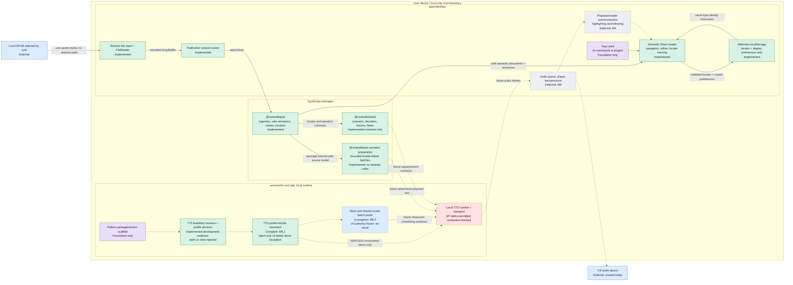
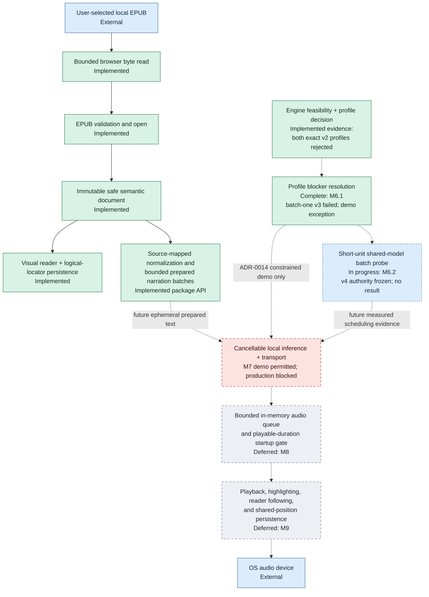

# Canonical system diagram

## Purpose and evidence rule

This is VoxLeaf's canonical high-level system map. It distinguishes running product behavior from repository foundations and approved or deferred work. A type, fake, scaffold, ADR, or plan is not implementation evidence by itself. Statuses here are based on production code plus the validation recorded in completed plans; future nodes appear only when accepted architecture or the roadmap supports them.

For detailed rationale and invariants, see the [architecture overview](overview.md). For milestone authority, see the [roadmap](../plans/roadmap.md) and [completed plans](../plans/completed/README.md).

## Status legend

| Status | Meaning |
| --- | --- |
| **Implemented** | Production code exists for the stated boundary and repository validation covers it. |
| **In progress** | Active implementation evidence exists, but the approved boundary is not complete. |
| **Approved planned** | An accepted decision or approved roadmap milestone authorizes the work; production implementation is not claimed. |
| **Blocked** | A required decision or prerequisite is missing or failed, so implementation is not authorized. |
| **Deferred** | The roadmap places the work after the next approved milestone or its design remains intentionally unresolved. |
| **Foundation only** | A scaffold, contract, fake, or shell exists without the runtime behavior its area will eventually own. |
| **External** | A user-, operating-system-, or hardware-owned boundary outside the repository. |

Solid arrows are implemented runtime or package relationships. Dashed arrows are approved planned, blocked, or deferred relationships and must not be read as working data flow.

## Current status snapshot

| Area | Status | Repository-backed boundary |
| --- | --- | --- |
| Desktop visual reader | **Implemented** | Local byte selection, publication lifecycle, safe semantic React rendering, navigation, reflow, preferences, logical-locator tracking, and bounded restoration. |
| EPUB ingestion | **Implemented** | Bounded in-memory open, archive/package/navigation validation, immutable safe semantics, lazy bounded raster access, and deterministic locators. |
| Narration preparation | **Implemented** | `@voxleaf/epub` exposes bounded, cancellable, locator-linked `OpenedPublication.prepareNarration` batches. The desktop has no production caller. |
| Shared contracts and fakes | **Implemented** | Versioned contracts, runtime decoders, conformance fixtures, and deterministic fakes exist; they do not implement TTS, queues, playback, or synchronization. |
| Tauri native shell | **Foundation only** | The shell starts the React application; no commands, plugins, filesystem capabilities, or process transport are configured. |
| Python TTS area | **Foundation only** | A package/version scaffold and schema conformance tests exist; there is no engine, server, model integration, inference, cancellation, or audio output. |
| TTS feasibility and profile decision | **Implemented** | The bounded candidate-neutral `v2` harness measured both exact profiles. The license/offline/packaging audit is complete; limited one-evaluator quality remains non-promotable; ADR-0013 selects neither profile. This is development evidence, not runtime behavior. |
| TTS profile blocker resolution | **Complete; standard blocker retained** | The exact Serena `v3` matrix passed cold load, RAM, VRAM, offline, artifact, license, packaging, cleanup, repository/privacy validation, and required pull-request CI but failed startup, throughput, zero-failure, and mid-generation cancellation. `selection-v3` retains the standard blocker while ADR-0014 permits the exact profile only for a bounded development demo. No passing standard or general hardware profile exists. |
| Short-unit shared-model batch feasibility | **In progress; authority frozen** | Milestone 6.2 Milestone 1 froze the separate `v4` authority, normalized eight-unit corpus, exact full-GPU and conditional speech-tokenizer CPU identities, memory stop, schemas, and model-free enforcement. No batch runner, hardware result, selection, or runtime exists. |
| Local TTS runtime and process transport | **Blocked for production; constrained demo permitted** | Milestone 7 may plan one development-only Qwen path with complete bounded units, explicit preparation/buffering, one queued unit, and identity-first worker termination. Production transport and continuous playback remain unselected. |
| Audio, synchronization, hardware support, and release packaging | **Deferred** | Milestones 8–11 remain after the blocked TTS runtime boundary; no production dependency or general hardware claim exists. |

## Component and trust-boundary map

```mermaid
flowchart LR
    classDef implemented fill:#d9f2e6,stroke:#247a52,color:#102a20
    classDef progress fill:#dcecff,stroke:#356aa0,color:#13253a,stroke-dasharray: 3 3
    classDef planned fill:#fff0c7,stroke:#9a6b00,color:#332400,stroke-dasharray: 5 5
    classDef blocked fill:#fde2e2,stroke:#b42318,color:#3a0d0d,stroke-dasharray: 5 5
    classDef deferred fill:#eceff3,stroke:#667085,color:#20242a,stroke-dasharray: 5 5
    classDef foundation fill:#e8e0f7,stroke:#6f4aa8,color:#241735
    classDef external fill:#dcecff,stroke:#356aa0,color:#13253a

    EPUB["Local EPUB selected by user<br/>External"]:::external
    AUDIO["OS audio device<br/>External; unused today"]:::external

    subgraph DEVICE["User device / local-only trust boundary"]
        subgraph DESKTOP["apps/desktop"]
            PICKER["Browser file input + FileReader<br/>Implemented"]:::implemented
            SESSION["Publication session owner<br/>Implemented"]:::implemented
            READER["Semantic React reader<br/>navigation, reflow, locator tracking<br/>Implemented"]:::implemented
            STORE["WebView localStorage<br/>locator + display preferences only<br/>Implemented"]:::implemented
            SHELL["Tauri shell<br/>no commands or plugins<br/>Foundation only"]:::foundation
            PLAYBACK["Audio queue, player, backpressure<br/>Deferred: M8"]:::deferred
            SYNC["Playback/reader synchronization<br/>highlighting and following<br/>Deferred: M9"]:::deferred
        end

        subgraph PACKAGES["TypeScript packages"]
            EPUBCORE["@voxleaf/epub<br/>ingestion, safe semantics, rasters, locators<br/>Implemented"]:::implemented
            PREP["@voxleaf/epub narration preparation<br/>bounded locator-linked batches<br/>Implemented; no desktop caller"]:::implemented
            SHARED["@voxleaf/shared<br/>contracts, decoders, fixtures, fakes<br/>Implemented contracts only"]:::implemented
        end

        subgraph TTSAREA["services/tts and later local runtime"]
            PYTHON["Python package/version scaffold<br/>Foundation only"]:::foundation
            FEASIBILITY["TTS feasibility harness + profile decision<br/>Implemented development evidence:<br/>both v2 roles rejected"]:::implemented
            PROFILE_CYCLE["TTS profile blocker resolution<br/>Complete: M6.1<br/>batch-one v3 failed; demo exception"]:::implemented
            BATCH_PROBE["Short-unit shared-model batch probe<br/>In progress: M6.2<br/>v4 authority frozen; no result"]:::progress
            TTS["Local TTS runtime + transport<br/>M7 demo permitted; production blocked"]:::blocked
        end
    end

    EPUB -->|"user grants bytes; no retained path"| PICKER
    PICKER -->|"bounded ArrayBuffer"| SESSION
    SESSION -->|"open/close"| EPUBCORE
    EPUBCORE -->|"safe semantic documents + resources"| READER
    READER -->|"validated locator + closed preferences"| STORE
    STORE -->|"same-byte identity restoration"| READER
    EPUBCORE -->|"package-internal safe source model"| PREP
    EPUBCORE -->|"locator and narration contracts"| SHARED
    SHELL --> READER

    PYTHON -.-> FEASIBILITY
    FEASIBILITY -.-> PROFILE_CYCLE
    PROFILE_CYCLE -.-> BATCH_PROBE
    PROFILE_CYCLE -.->|"ADR-0014 constrained demo only"| TTS
    BATCH_PROBE -.->|"future measured scheduling evidence"| TTS
    PREP -.->|"future ephemeral prepared text"| TTS
    SHARED -.->|"future request/event contracts"| TTS
    TTS -.->|"future audio frames"| PLAYBACK
    PLAYBACK -.-> AUDIO
    PLAYBACK -.-> SYNC
    SYNC -.-> READER
```

The diagram deliberately has no solid edge from the desktop session to narration preparation: the API is implemented and validated at the package boundary, but the production desktop does not call it. The Python node is also not a running process. No transport, audio format, playback API, engine, model, or deployment topology is selected by this map.

## EPUB-to-audio flow

```mermaid
flowchart TD
    classDef implemented fill:#d9f2e6,stroke:#247a52,color:#102a20
    classDef progress fill:#dcecff,stroke:#356aa0,color:#13253a,stroke-dasharray: 3 3
    classDef planned fill:#fff0c7,stroke:#9a6b00,color:#332400,stroke-dasharray: 5 5
    classDef blocked fill:#fde2e2,stroke:#b42318,color:#3a0d0d,stroke-dasharray: 5 5
    classDef deferred fill:#eceff3,stroke:#667085,color:#20242a,stroke-dasharray: 5 5
    classDef external fill:#dcecff,stroke:#356aa0,color:#13253a

    FILE["User-selected local EPUB<br/>External"]:::external
    READ["Bounded browser byte read<br/>Implemented"]:::implemented
    OPEN["EPUB validation and open<br/>Implemented"]:::implemented
    SAFE["Immutable safe semantic document<br/>Implemented"]:::implemented
    VISUAL["Visual reader + logical-locator persistence<br/>Implemented"]:::implemented
    PREP["Source-mapped normalization and<br/>bounded prepared narration batches<br/>Implemented package API"]:::implemented
    PROFILE["Engine feasibility + profile decision<br/>Implemented evidence:<br/>both exact v2 profiles rejected"]:::implemented
    NEXT_PROFILE["Profile blocker resolution<br/>Complete: M6.1<br/>batch-one v3 failed; demo exception"]:::implemented
    BATCH_PROBE["Short-unit shared-model batch probe<br/>In progress: M6.2<br/>v4 authority frozen; no result"]:::progress
    INFER["Cancellable local inference + transport<br/>M7 demo permitted; production blocked"]:::blocked
    BUFFER["Bounded in-memory audio queue<br/>and playable-duration startup gate<br/>Deferred: M8"]:::deferred
    FOLLOW["Playback, highlighting, reader following,<br/>and shared-position persistence<br/>Deferred: M9"]:::deferred
    DEVICE["OS audio device<br/>External"]:::external

    FILE --> READ --> OPEN --> SAFE --> VISUAL
    SAFE --> PREP
    PREP -.->|"future ephemeral prepared text"| INFER
    PROFILE -.-> NEXT_PROFILE
    NEXT_PROFILE -.-> BATCH_PROBE
    NEXT_PROFILE -.->|"ADR-0014 constrained demo only"| INFER
    BATCH_PROBE -.->|"future measured scheduling evidence"| INFER
    INFER -.-> BUFFER
    BUFFER -.-> FOLLOW
    FOLLOW -.-> DEVICE
```

The current user-visible flow ends at `VISUAL`. `PREP` is usable by package callers and tests but is not wired into the desktop. `NEXT_PROFILE` is completed evidence and `BATCH_PROBE` has only a frozen development authority and model-free validator; neither is runtime behavior or a selected production engine. All inference steps after them are future work. Approximately 15 seconds is a target amount of playable audio held in the future bounded buffer, not a fixed wall-clock delay; a shorter complete remaining range may start when fully ready.

## Privacy, persistence, cancellation, and bounds

- EPUB bytes, safe semantic content, and derived narration text remain inside the local-device trust boundary.
- Only versioned logical reading locators, exact-byte publication identity, and closed display preferences are persisted. EPUB bytes, narration text, model output, and generated audio are not persisted by default.
- The durable reading position is a stable EPUB logical locator, never a rendered page number.
- Implemented ingestion, raster access, reader rendering, and persistence limits are documented in the [architecture overview](overview.md) and their accepted ADRs. Narration preparation has a separate [accepted limits profile](narration-preparation-limits-v1.md).
- Implemented publication and preparation work supports cancellation and close. Future narration, inference, queues, buffering, and playback must propagate cancellation and reject stale session or generation work across every boundary.
- Future audio queues and buffers must be bounded and observable. Underruns, startup latency, playable depth, real-time factor, memory, and cancellation latency must be measured without logging book text, narration text, generated audio, secrets, or private data.
- Network TTS and remote book processing remain outside the product boundary.

## Evidence and decision authority

| Boundary | Primary evidence |
| --- | --- |
| Workspace foundation | [Milestone 1 completed plan](../plans/completed/M001-engineering-foundation.md), [ADR-0005](decisions/ADR-0005-engineering-workspace-and-quality-tooling.md) |
| Contracts and fakes | [Milestone 2 completed plan](../plans/completed/M002-shared-contracts-and-test-harness.md), [ADR-0006](decisions/ADR-0006-json-schema-contract-authority.md) |
| Secure EPUB ingestion and locator model | [Milestone 3 completed plan](../plans/completed/M003-secure-epub-ingestion-and-document-model.md), [ADR-0007](decisions/ADR-0007-secure-epub-ingestion-boundary.md), [ADR-0003](decisions/ADR-0003-stable-reading-locators.md) |
| Visual reader and local restoration | [Milestone 4 completed plan](../plans/completed/M004-reflowable-visual-reader-and-position-restoration.md), [ADR-0008](decisions/ADR-0008-visual-reader-architecture.md), [ADR-0011](decisions/ADR-0011-bounded-web-storage-reader-state.md) |
| Native Windows startup evidence | [Milestone 4 native smoke closeout](../plans/completed/M004-001-native-webdriver-startup-smoke.md) |
| Narration preparation | [Milestone 5 completed plan](../plans/completed/M005-narration-text-preparation.md), [ADR-0012](decisions/ADR-0012-bounded-narration-preparation.md), [narration normalization](narration-normalization-v1.md) |
| Playable-audio startup rule | [ADR-0004](decisions/ADR-0004-start-after-audio-lead.md); target only until Milestone 8 |
| Local TTS feasibility authority | [Milestone 6 completed plan](../plans/completed/M006-local-tts-feasibility-and-engine-profiles.md), [current v2 feasibility profile](tts-feasibility-profile-v2.md), [selection matrix](../../benchmarks/tts/selection-v2.md), and [ADR-0013](decisions/ADR-0013-no-viable-local-tts-engine-profile.md); both exact roles rejected and no production profile selected |
| Local TTS profile blocker resolution | [Milestone 6.1 completed plan](../plans/completed/M006-001-local-tts-profile-blocker-resolution.md), [Serena intake result](../../benchmarks/tts/customvoice-spanish-screen-result-v2.json), machine-readable [`profile-v3.json`](../../benchmarks/tts/profile-v3.json), [v3 authority](tts-feasibility-profile-v3.md), [passing exact-host prototype result](../../benchmarks/tts/incremental-cancellation-prototype-result-v1.json), [candidate-neutral `selection-v3`](../../benchmarks/tts/selection-v3.md), and [ADR-0014 constrained demo decision](decisions/ADR-0014-constrained-qwen-development-demo.md) |
| Short-unit shared-model batch feasibility | [Milestone 6.2 active ExecPlan](../plans/active/M006-002-qwen-short-segment-batch-feasibility.md), [v4 authority](tts-feasibility-profile-v4.md), machine-readable [`profile-v4.json`](../../benchmarks/tts/profile-v4.json), normalized [`corpus-v4.json`](../../benchmarks/tts/corpus-v4.json), and model-free enforcement; no runner, batch-two result, CPU-placement result, or runtime exists yet |
| Local-first desktop and future local process direction | [ADR-0001](decisions/ADR-0001-local-first-desktop.md); ADR-0014 permits a constrained development demo while production transport remains unresolved |
| Roadmap status | [Roadmap](../plans/roadmap.md) |

## Remaining gates

1. **Milestone 6.2 — In progress:** implement and execute the separately frozen short-unit/shared-model batch evaluation. Run targeted CPU placement only if the full-GPU arm reaches its predeclared memory stop condition.
2. **Milestone 7 — Constrained demo permitted; production blocked:** plan one bounded Qwen development-demo vertical slice under ADR-0014. Do not claim passing performance, continuous playback, native streaming, general hardware support, or production transport.
3. **Milestone 8 — Deferred:** implement bounded audio framing, queueing, playback, backpressure, underrun telemetry, and the duration-based startup gate.
4. **Milestone 9 — Deferred:** connect one stable logical position across the visual reader, prepared narration, playback progress, highlighting, following, seek, and restoration.
5. **Milestones 10–11 — Deferred:** validate hardware profiles and CPU fallback, then complete installer/signing/distribution and full MVP closeout.

Update this document whenever a major component boundary, process/package dependency, trust boundary, persistence owner, external interaction, runtime flow, or roadmap implementation status changes. A completed plan may advance a node or arrow only when its definition of done and validation evidence are present.
